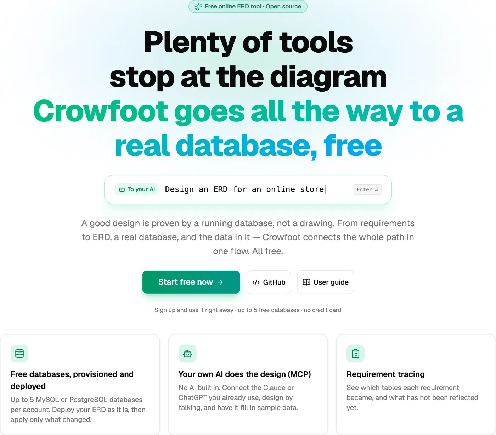
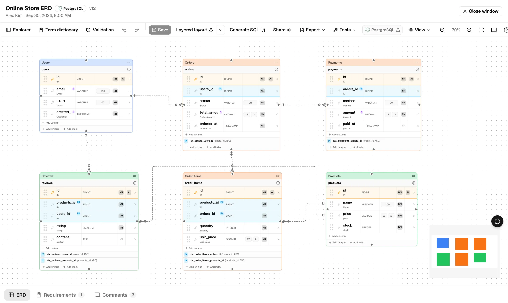
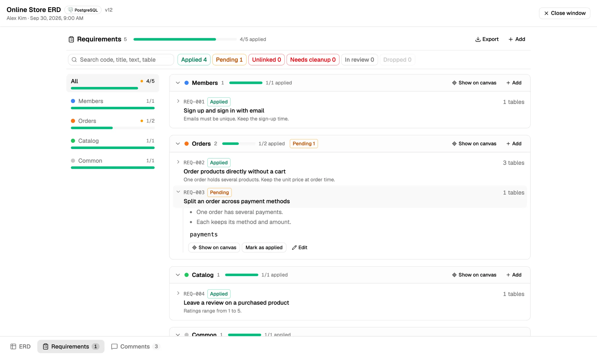
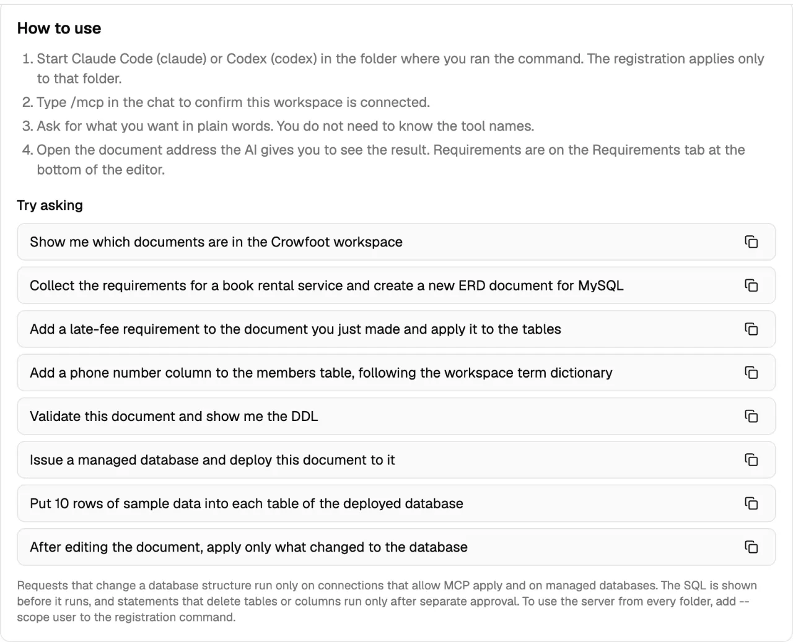
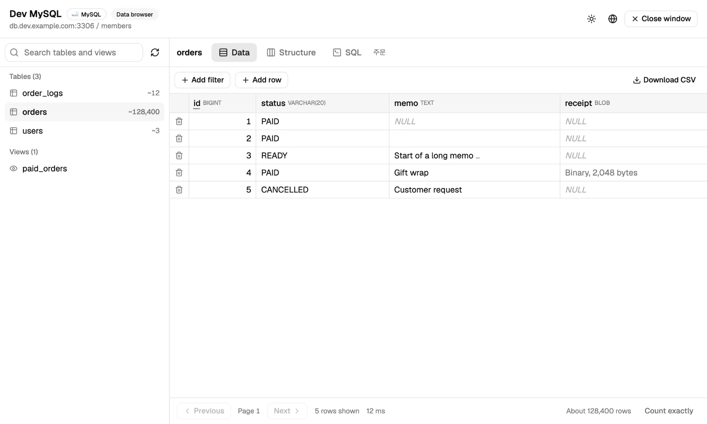
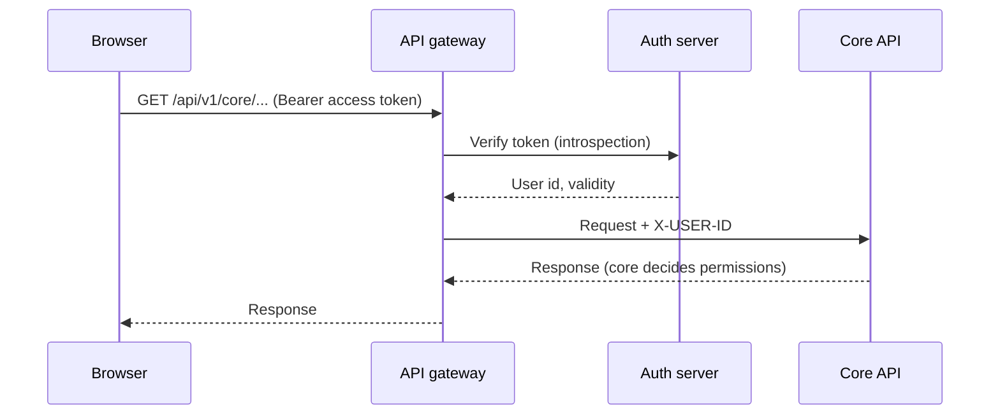
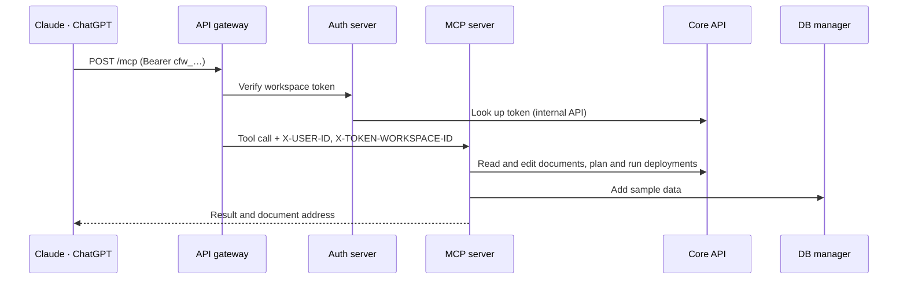
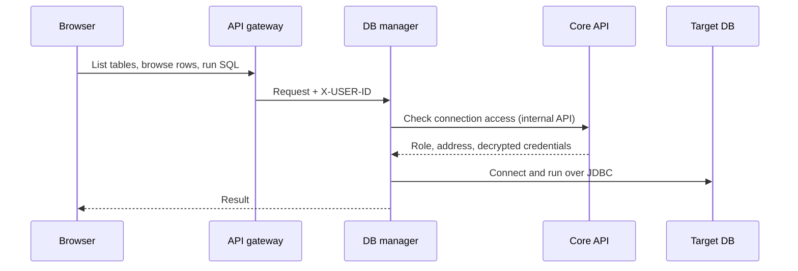

<div align="center">

🌐 **[한국어](./README.md)** | **English** | **[日本語](./README.ja.md)** | **[简体中文](./README.zh.md)**


# Crowfoot

**Plenty of tools stop at the ERD. Crowfoot goes all the way to a real database.**

An open-source ERD platform that takes you from requirements → ERD → a real database → data, all in one browser

[](https://www.apache.org/licenses/LICENSE-2.0)
[](https://crowfoot.java21.net/release-notes/51)
[](https://crowfoot.java21.net)
[](https://crowfoot.java21.net/guide#20.1)

[Try it now](https://crowfoot.java21.net) · [User guide](https://crowfoot.java21.net/guide) · [Release notes](https://crowfoot.java21.net/release-notes) · [Browse shared ERDs](https://crowfoot.java21.net/shared)

</div>

<p align="center">
  
</p>

The name comes from **Crow's Foot notation**, which draws the relationships between tables with a symbol shaped like a crow's foot.

## Contents

- [Why Crowfoot](#why-crowfoot)
- [Quick start](#quick-start)
- [Features](#features)
- [Architecture](#architecture)
- [Repositories](#repositories)
- [Run it yourself](#run-it-yourself)
- [Tech stack](#tech-stack)
- [Releases](#releases)
- [Contributing](#contributing)
- [License](#license)

## Why Crowfoot

| | Typical ERD tools | Crowfoot |
| --- | --- | --- |
| Output | Diagrams, DDL files | Diagrams and DDL, plus **a database that actually runs** |
| Database | Bring your own | **Free** MySQL and PostgreSQL development databases (5 per user in each workspace) |
| Applying changes | Run DDL by hand | Computes the difference between the document and the database, then **generates and runs migration SQL**. Drop statements need separate approval |
| AI | None, or an AI tied to the tool | **Connect the Claude or ChatGPT you already use over MCP**. Crowfoot has no AI built in |
| Requirements | A separate document | Requirements are saved with the ERD, and you can **trace which tables implement them** |
| Data | Check it in another tool | Browse and edit data, run SQL and add sample data in the **data browser** |
| Collaboration | Share files | **Real-time co-editing**, comments, version history, share links |

## Quick start

### Use the hosted service

1. Sign in at https://crowfoot.java21.net with your GitHub or Google account.
2. Create a workspace and open an ERD document. Start from a blank document, import an SQL script, or read an existing database into an ERD.
3. On the **Database** tab, issue a free MySQL or PostgreSQL database and deploy your document to it.

### Connect Claude or ChatGPT (MCP)

Issue a token on your workspace's **MCP** tab, and you get a registration command with the token already filled in.

```bash
claude mcp add --transport http crowfoot https://crowfoot-mcp.java21.net/mcp \
  --header "Authorization: Bearer <your token>"
```

Then hand off the work in conversation.

```text
> Collect the requirements for a book rental service and turn them into an ERD
> Issue a free MySQL database and deploy it
> Put 10 rows of sample data into each table
```

What the AI creates shows up in Crowfoot as is, and the AI reads back whatever you change on screen. See [section 20 of the user guide](https://crowfoot.java21.net/guide#20.1) for details.

## Features

<table>
<tr>
<td width="50%"><br/><b>ERD editor</b> — Crow's Foot notation, auto layout, groups, notes</td>
<td width="50%"><br/><b>Requirement tracing</b> — progress by domain, tables without a requirement</td>
</tr>
<tr>
<td width="50%"><br/><b>AI integration (MCP)</b> — connection command and example requests</td>
<td width="50%"><br/><b>Data browser</b> — browsing, row editing, SQL console</td>
</tr>
</table>

### Design

- **ERD editor in your browser** — Use it right away, nothing to install. Draw tables, columns, keys, indexes and relationships in Crow's Foot notation, and tidy up even large documents with auto layout (layered, hub-centered, hybrid).
- **Logical and physical models** — Manage logical and physical names together, and convert common types into DBMS-specific types. Supported target DBMSs are MySQL, PostgreSQL, Oracle and SQL Server.
- **Standard dictionary** — Keep names and types consistent with word and term dictionaries and domain types. Crowfoot suggests physical names from logical names, and changing a domain type carries over to the columns that use it.
- **Design validation** — 17 rules, such as duplicate names, FK type mismatches and missing primary keys, are checked continuously.
- **Requirements** — Save requirements in the document and link them to tables. When a requirement changes, it is marked "Pending", and you get progress by domain, acceptance criteria and Markdown/CSV export.

### Databases

- **Free managed databases** — Issue a MySQL or PostgreSQL development database with one click. Each issue gets a dedicated account with privileges on its own schema only, and the instance admin account is never handed out anywhere.
- **SQL generation and deployment** — Turn a document into DDL for its DBMS and deploy it straight to a connected database.
- **Reverse engineering** — Read an existing database or import an SQL script to create an ERD document.
- **Migration** — Recompute the difference between the document and the database, then generate and run the change SQL. Statements that drop tables or columns are not run by default.
- **Data browser** — Browse, filter and sort the data in a connected database, edit rows, and run SQL.

### Collaboration and sharing

- **Real-time collaboration** — Several people edit the same document at once. You see who is online, their cursors and their selections in real time.
- **Workspaces and teams** — Invite users and teams as Owner, Editor, Commenter or Viewer.
- **Version history** — Every save keeps a version. Compare two versions or roll back.
- **Sharing** — Share read-only with a link and collect likes and comments. Anyone can find shared documents in the [shared ERD list](https://crowfoot.java21.net/shared).
- **ERD library** — More than 500 example ERDs on real-world topics, published with notes on requirements and design.

### More

- **Four languages** — Korean, English, Japanese and Chinese screens and user guide
- **AI integration (MCP)** — 26 tools: reading and creating documents, applying and syncing requirements and schemas, checking acceptance criteria with data, issuing, deploying and migrating databases, syncing database structure into documents, sample data, and bug reports. Issuing, deploying and applying show a plan first and run only what you approve.
- **Site showcase** — Register a site built from your ERD on a document, and it is featured with a thumbnail on the landing page and `/showcase`. The capture service makes the thumbnails.
- **Admin console** — Users, code tables, managed DB instances, issue quotas, audit logs and traffic analytics

## Architecture

Crowfoot is made of eight microservices. Every HTTP request from outside goes through the API gateway, and services talk to each other only through internal calls inside the cluster.


### Services

| Service | What it does | Storage | Depends on |
| --- | --- | --- | --- |
| **crowfoot-web** | React SPA. Editor, dashboard, admin console, public pages | — | gateway, collab |
| **crowfoot-api-gateway** | The entry point for all HTTP requests. Routing by path and host, token verification, public-path allowlist, user identity header (`X-USER-ID` and others) injection | — | auth |
| **crowfoot-auth** | GitHub and Google OAuth2 sign-in (PKCE), JWT issue and refresh, token verification (introspection), logout blacklist | Redis | core (members, workspace tokens) |
| **crowfoot-core-api** | The center of the domain. Members, workspaces, teams, documents, requirements and comments, SQL generation, deployment, reverse engineering and migration, managed DB issuing, audit logs | PostgreSQL | managed DB instances, user databases, capture |
| **crowfoot-collab** | Real-time collaboration. Relays presence and edits in WebSocket (STOMP) rooms | Memory | auth, core |
| **crowfoot-database-manager** | Data browser. Browsing, row editing, SQL console and sample data. Has no database of its own and connects per request | — | core (permissions, connection info) |
| **crowfoot-mcp** | MCP server. Turns tool calls from Claude and ChatGPT into calls to core and the DB manager | — | core, database-manager |
| **crowfoot-capture** | Capture service. Opens a site URL in headless Chromium and returns an 800×500 JPEG thumbnail with metadata (title, description, site name, favicon). No gateway route; only core calls it | — (core stores the thumbnails) | — |

### Request flows

**Sign-in and API calls** — The access token lives only in browser memory, and the refresh token in a `SameSite=Strict` cookie. The gateway verifies the token with the auth server on every request.



**AI integration (MCP)** — A workspace token (`cfw_…`) carries the permissions of the person who issued it and works only inside that workspace. The token can pass only the MCP path, and the regular API is blocked.



**Data browser** — The DB manager does not store connection info. On every request it gets permissions and connection info from the core API, then connects to the target database.



**Real-time collaboration** — The browser connects to the collaboration server directly over WebSocket. The collaboration server checks the token and document permissions when you connect, and relays the changes in a room in order. Documents are saved over HTTP to the core API, and concurrent saves are prevented by version comparison.

### Security and data protection

- **Password encryption** — Connection passwords and issued account passwords are stored encrypted with AES-256-GCM.
- **Permissions are decided in core** — Other services do not decide permissions on their own; they ask the core API. Other people's resources return 404, hiding that they exist at all.
- **Isolated issued accounts** — Each managed DB issue gets an account with privileges on its own schema only, and revoking it deletes both the schema and the account.
- **Internal addresses** — In production, servers connect to managed databases through internal addresses inside the cluster. Users are shown addresses they can reach from outside.
- **Private network blocking (SSRF)** — For each capture, the capture service starts a checking proxy on loopback and routes every browser connection through it. The proxy resolves the host itself, rejects private, loopback, link-local, CGNAT and IPv6 ULA addresses, and connects only to the checked IP, which also defeats DNS rebinding.
- **Audit logs** — Important actions such as issuing, revoking, deploying, migrating and viewing connection info are recorded.

### Deployment

Deployment is GitOps. When you push to `main` in a service repository, GitHub Actions runs the tests, builds an image and pushes it to GHCR, then updates the image tag in the deployment repository. Argo CD applies that change to the Kubernetes cluster. All production servers run on port 8080, and secrets are injected only through environment variables.

## Repositories

| Repository | Description |
| --- | --- |
| [crowfoot-web](https://github.com/crowfoot-erd/crowfoot-web) | Frontend — React SPA. ERD editor (React Flow), dashboard, workspaces and teams, admin console, collaboration client (STOMP), four languages and dark mode, user guide |
| [crowfoot-api-gateway](https://github.com/crowfoot-erd/crowfoot-api-gateway) | API gateway — Spring Cloud Gateway. Routing, token verification, user identity headers, public-path allowlist |
| [crowfoot-auth](https://github.com/crowfoot-erd/crowfoot-auth) | Auth server — OAuth2 sign-in (GitHub, Google, PKCE), JWT issue, refresh and verification, workspace token verification, Redis blacklist |
| [crowfoot-core-api](https://github.com/crowfoot-erd/crowfoot-core-api) | Core API — members, workspaces, teams, documents, requirements and comments, managed DB issuing and revoking, SQL generation, deployment, reverse engineering and migration, document editing API, code tables and audit logs |
| [crowfoot-collab](https://github.com/crowfoot-erd/crowfoot-collab) | Collaboration server — WebSocket (STOMP). Real-time relay of per-document presence and edits |
| [crowfoot-database-manager](https://github.com/crowfoot-erd/crowfoot-database-manager) | DB manager — data browsing, row editing, SQL console and sample data. Has no database of its own, connects per request, and asks the core API for permissions |
| [crowfoot-mcp](https://github.com/crowfoot-erd/crowfoot-mcp) | MCP server — Spring AI MCP. Provides tools for reading and writing requirements and ERDs, issuing, deploying and migrating databases, and sample data |
| [crowfoot-capture](https://github.com/crowfoot-erd/crowfoot-capture) | Capture service — Playwright (headless Chromium). Produces thumbnails and metadata for the site showcase. Internal only: called by the core API alone, and private network addresses are blocked |

## Run it yourself

### Prerequisites

| Tool | Version | Used by |
| --- | --- | --- |
| Java (Temurin) | 21 | the seven servers |
| Maven | 3.9+ | building and running the servers |
| Node.js / pnpm | 20.19+ / 10 | frontend |
| PostgreSQL | 16+ | service database (`crowfoot` database, `crowfoot_core` schema) |
| Redis | 6+ | logout blacklist |

The schema is not created automatically (`ddl-auto: none`). Initialize it with a DDL script first.

### Local ports

| Service | Port | Notes |
| --- | --- | --- |
| crowfoot-web (Vite) | 8080 | Forwards `/api` requests to the gateway (8000) |
| crowfoot-api-gateway | 8000 | Routes to auth, core and database-manager, and `/mcp` on the MCP host to the MCP server |
| crowfoot-auth | 8081 | |
| crowfoot-core-api | 8082 | |
| crowfoot-collab | 8083 | WebSocket — connected directly, not through the gateway |
| crowfoot-database-manager | 8084 | |
| crowfoot-mcp | 8085 | |
| crowfoot-capture | 8086 | Needed only when registering a showcase site. Install Chromium once first — see the repository README |

### Environment variables

Each server reads `.env-local` (not committed to git) from the repository root. Copy `.env-local.example` and fill in the values. The gateway, collab, DB manager and MCP server need no extra values.

**crowfoot-auth**

| Variable | Description |
| --- | --- |
| `CROWFOOT_AUTH_JWT_SECRET` | JWT HS256 signing key — Base64, 32+ bytes (`openssl rand -base64 48`) |
| `CROWFOOT_AUTH_FLOW_SECRET` | HMAC-SHA256 signing key for the sign-in flow cookie (`auth_flow`) — keep it separate from the JWT key |
| `CROWFOOT_AUTH_GITHUB_CLIENT_ID` / `..._SECRET` | GitHub OAuth app credentials |
| `CROWFOOT_AUTH_GOOGLE_CLIENT_ID` / `..._SECRET` | Google OAuth client credentials (PKCE) |
| `CROWFOOT_REDIS_PASSWORD` / `CROWFOOT_REDIS_DATABASE` | Redis connection (the host is in `application-local.yml`) |

Register `http://localhost:8080/auth/callback` as the redirect URI in your OAuth apps.

**crowfoot-core-api**

| Variable | Description |
| --- | --- |
| `DB_URL` | PostgreSQL JDBC URL — `jdbc:postgresql://{host}:5432/crowfoot?currentSchema=crowfoot_core` |
| `DB_USERNAME` / `DB_PASSWORD` | Service database account |
| `CROWFOOT_CONNECTION_SECRET_KEY` | Encryption key for connection passwords — Base64, 32 bytes. Local has a development default; production must set it |

**crowfoot-web** — Development uses the defaults as they are (leave `VITE_API_BASE_URL` empty so the Vite proxy keeps everything same-origin). Production builds set `VITE_API_BASE_URL` (gateway address), `VITE_WS_URL` (collaboration server address, `wss://`) and `VITE_MCP_URL` (MCP address).

### Start

```bash
# the seven servers — from each repository (local profile is the default)
mvn spring-boot:run

# frontend
pnpm install
pnpm dev        # http://localhost:8080
```

The recommended order is auth → core-api → gateway → collab · database-manager · mcp → web. The gateway can verify tokens only once auth is up.

## Tech stack

### Common foundation

| Technology | Version | Used in | Why and what |
| --- | --- | --- | --- |
| Java | 21 | the seven servers | The LTS release. Today's baseline, with records, pattern matching and virtual threads |
| Spring Boot | 4.1 | the seven servers | Every server runs the same version, so configuration, logging and health checks (Actuator) work the same way everywhere. Kubernetes checks server status through the Actuator health checks |
| Spring Cloud | 2025.1 | gateway, auth, database-manager | Manages the versions for the gateway and inter-service calls (OpenFeign, LoadBalancer) as one set |
| Lombok | — | servers | Cuts down repetitive code such as constructors and accessors |

### By server

| Server | Core technologies | Why and what it does |
| --- | --- | --- |
| **crowfoot-api-gateway** | Spring Cloud Gateway (WebFlux) | The entry point for all HTTP requests. Being non-blocking (reactive), it relays many requests with few threads. It routes by path and host (`/api/v1/core/**` → core, `/mcp` on the MCP host → MCP server), and a global filter verifies the token with the auth server before adding user identity headers (`X-USER-ID` and others). Public paths that open without sign-in are managed in an allowlist |
| **crowfoot-auth** | Spring Security · OAuth2 Client · spring-security-oauth2-jose · Spring Data Redis · OpenFeign | Handles GitHub and Google sign-in (OAuth2, with PKCE for Google). Access tokens are issued and verified as JWTs (HS256), and refresh tokens are kept in a cookie. Logged-out tokens stay in a Redis blacklist only until they expire. It asks core for member info and workspace tokens through OpenFeign |
| **crowfoot-core-api** | Spring Web MVC · Spring Data JPA (Hibernate 7) · Querydsl 5.1 · Bean Validation · PostgreSQL/MySQL JDBC · Commons DBCP2 · MaxMind GeoIP2 | The center of the domain. JPA stores members, workspaces and documents, and dynamic conditions such as lists and search are written type-safely with Querydsl (associations are loaded with fetch joins to prevent N+1 queries). Through JDBC drivers it reads users' databases into ERDs (reverse engineering), deploys DDL and issues free databases. GeoIP2 provides the per-country breakdown in the admin traffic analytics |
| **crowfoot-collab** | Spring WebSocket · STOMP · RestClient | The real-time collaboration server. Each document has its own STOMP room, where presence, cursors and edits are relayed in order. On connect, it uses RestClient to check the token with auth and document permissions with core |
| **crowfoot-database-manager** | Spring Web MVC · JDBC (PostgreSQL·MySQL drivers) · OpenFeign | The data browser. It has no database of its own: for each request it connects to the target database over JDBC and closes the connection when done. It asks core for connection info and permissions through OpenFeign. Row edits and sample data are applied in a single transaction |
| **crowfoot-mcp** | Spring AI 2.0 (MCP Server, WebMVC) · RestClient | The entry point for MCP clients such as Claude and ChatGPT. It exposes 26 tools through Spring AI's MCP server (HTTP transport) and turns tool calls into internal API calls to core and database-manager. Its server instructions tell the AI the order of work and the rules to follow |
| **crowfoot-capture** | Spring Web MVC · Playwright for Java 1.63 (Chromium headless shell) · java.awt ImageIO | The internal service that makes site showcase thumbnails. It opens the URL core passes in headless Chromium, takes a screenshot, scales it to an 800×500 JPEG with ImageIO, and reads the title, description, site name and favicon along the way. It runs at most two captures at a time, 20 seconds each, and every browser connection goes through a checking proxy that blocks private network addresses |

### Frontend (crowfoot-web)

| Technology | Version | Where and why |
| --- | --- | --- |
| React | 19 | The entire UI. The editor, dashboard and admin console are built from components |
| TypeScript | 6 | Checks document structure and API response types in code |
| Vite | 8 | Dev server and build. At build time it also generates the sitemap and prerenders public pages (for search visibility) |
| React Router | 7 | Navigation and per-language URLs (`/en`, `/ja`, `/zh`) |
| TanStack Query | 5 | Fetching, caching and refetching server data. Handles loading and error states consistently across list and detail screens |
| Zustand | 5 | UI state such as the editor document, undo and redo, and which panels are open |
| React Flow (@xyflow/react) | 12 | The ERD canvas. Draws table nodes and relationship lines and handles zooming, panning and selection. Relationship line paths and Crow's Foot notation are implemented in-house |
| elkjs | 0.12 | Auto layout (layered). It only computes table positions; our own router redraws the relationship lines |
| Zod | 4 | Schema validation for the document body (JSON). Older documents are read safely too |
| Tailwind CSS · shadcn/ui (Radix UI) | 4 · — | Styling and base components (dialogs, menus, tabs). Dark mode and theme colors are managed as tokens |
| i18next · react-i18next | 26 · 17 | UI text in four languages (Korean, English, Japanese, Chinese) |
| CodeMirror | 6 | SQL console. Syntax highlighting and autocomplete for keywords and table names |
| Toast UI Editor | 3 | Writing and displaying Markdown for community posts, release notes and the user guide |
| STOMP.js | 7 | Real-time collaboration client |
| Recharts | 3 | Charts for the admin traffic analytics |
| html-to-image | 1 | Exporting the ERD as a PNG image |

### Data and infrastructure

| Technology | Used in | Role |
| --- | --- | --- |
| PostgreSQL 16 | core | Service database (members, workspaces, documents, audit logs; `crowfoot_core` schema). Also the instance that free PostgreSQL databases are issued from |
| MySQL 8 | core, database-manager | The instance that free MySQL databases are issued from |
| Redis 6 | auth | Blacklist of logged-out access tokens (TTL set to the expiry time, persisted with AOF) |
| Docker · GHCR | the seven servers, web | Each repository builds an image and pushes it to GitHub Container Registry |
| GitHub Actions | 8 repositories | A push to main runs the tests, builds an image, then updates the image tag in the deployment repository |
| Kubernetes · Argo CD | production | Argo CD watches the deployment repository (`apps/*`) and applies changes to the cluster (GitOps). Servers are replaced one by one with rolling updates for zero-downtime deployment |
| nginx | edge, web | At the edge, it terminates TLS and forwards traffic by host. Inside the web container, it serves static files and prerendered pages |

### Testing

| Technology | Used in | Role |
| --- | --- | --- |
| JUnit 5 · Spring Boot Test | the seven servers | Unit and integration tests |
| Testcontainers | core, database-manager | Verifies SQL generation, reverse engineering and data editing against real PostgreSQL and MySQL containers |
| MockWebServer · embedded-redis | gateway, auth, collab | Stands in for other services and Redis to verify inter-service calls |
| Vitest · Testing Library | web | UI and logic tests (about 1,300) |
| MSW | web | Mock API server. Used in tests and for capturing user guide screenshots |
| Playwright | web | Checks in a real browser, and captures screenshots for the user guide and release notes |

## Releases

Every version ships with [release notes](https://crowfoot.java21.net/release-notes) in four languages. Each version is tagged with the same git tag (`vX.Y`) in all eight service repositories — repositories with no changes also get the tag to keep the system version aligned.

| Version | Date | Highlights | Release notes |
| --- | --- | --- | --- |
| v1.40 | 2026-10-08 | Site Showcase (register a site built from a document, automatic thumbnails, reports), new capture service, automatic group colors, PostgreSQL default fix (MCP report 50) | [View](https://crowfoot.java21.net/release-notes/51) |
| v1.39 | 2026-10-08 | Tables join their requirement's group (editor and MCP), better MCP design flow (requirements draft first, deployment plan warnings, rewriting documents) | [View](https://crowfoot.java21.net/release-notes/49) |
| v1.38 | 2026-10-07 | Change plan fix for same-name indexes (MCP report 47), deleting indexes with MCP | [View](https://crowfoot.java21.net/release-notes/48) |
| v1.37 | 2026-10-07 | Smoother table dragging, relationship lines on all four sides and best-of-candidates auto layout, PostgreSQL special indexes (GIN, expression, partial, INCLUDE, operator class) and IDENTITY kind, Suggestions & Reports notifications fixed | [View](https://crowfoot.java21.net/release-notes/46) |
| v1.36 | 2026-10-06 | Checking acceptance criteria with data, requirement sync (MCP), lighter data browsing (keyset paging, may-be-slow notice) | [View](https://crowfoot.java21.net/release-notes/42) |

<details>
<summary>Earlier versions (v1.08 – v1.35)</summary>

| Version | Date | Highlights | Release notes |
| --- | --- | --- | --- |
| v1.35 | 2026-10-06 | Data tab inside the editor, following foreign keys and generated columns, comparing with the document in the structure tab, changed requirements through to the database, renames in migrations (RENAME), MCP database sync | [View](https://crowfoot.java21.net/release-notes/40) |
| v1.34 | 2026-10-06 | Deployment SQL fixes (quoted string defaults, VARBINARY length), CHECK constraints, generated columns, full-text indexes, validation warnings as intended exceptions, Feedback notifications, MCP bug reports | [View](https://crowfoot.java21.net/release-notes/38) |
| v1.33 | 2026-10-03 | One design across the site (primary color, menus, titles), polished user guide (same-scale images, expanded explanations, four-language edits), 33 release notes rewritten, free DBs can be issued and revoked locally too | [View](https://crowfoot.java21.net/release-notes/35) |
| v1.32 | 2026-10-03 | AI integration extended (sample data, document links, drop statements skipped by default), requirements organized by domain (progress, search, export, acceptance criteria), shared documents list and release notes with a table of contents, new start page, new-version notice | [View](https://crowfoot.java21.net/release-notes/34) |
| v1.31 | 2026-10-02 | Claude integration (MCP — connect Claude Code with a workspace token, build requirements and ERDs through conversation), requirements panel (linked tables, pending status), automatic placement on open, per-connection Allow MCP apply | [View](https://crowfoot.java21.net/release-notes/33) |
| v1.30 | 2026-10-02 | Terms linked to domain types, column name suggestions split into terms and words, one standards panel, user guide (screenshots in four languages, search) | [View](https://crowfoot.java21.net/release-notes/32) |
| v1.29 | 2026-10-02 | Domain types (shared type definitions, previewed propagation of changes), paste into another document, editing a relationship's column mapping, auto layout direction | [View](https://crowfoot.java21.net/release-notes/31) |
| v1.28 | 2026-10-01 | Data browser (browse, filter, sort, CSV), row editing (collected and applied at once, conflict detection), SQL console (syntax highlighting, autocomplete) | [View](https://crowfoot.java21.net/release-notes/30) |
| v1.27 | 2026-10-01 | Duplicate for another DBMS, tidier editor toolbar, document list actions menu, refreshed landing and sign-in pages | [View](https://crowfoot.java21.net/release-notes/29) |
| v1.26 | 2026-09-30 | Link documents to databases, apply migration DDL to the database (recompute at run time, per-statement report) | [View](https://crowfoot.java21.net/release-notes/28) |
| v1.25 | 2026-09-29 | ERD library launch (509 real-world topics), balanced layout spacing | [View](https://crowfoot.java21.net/release-notes/27) |
| v1.24 | 2026-09-29 | Three auto-layout modes, relationship lines rerouting live during drag, automatic unique key on 1:1 relationships, document list pagination | [View](https://crowfoot.java21.net/release-notes/26) |
| v1.23 | 2026-09-28 | Release note image improvements, deployment procedure documented — no feature changes | [View](https://crowfoot.java21.net/release-notes/25) |
| v1.22 | 2026-09-28 | Notifications (header bell, three events, a full notifications page) | [View](https://crowfoot.java21.net/release-notes/24) |
| v1.21 | 2026-09-28 | Document-level feedback (likes, anonymous comments, author replies), SQL export from the public viewer | [View](https://crowfoot.java21.net/release-notes/23) |
| v1.20 | 2026-09-27 | Design validation (17 rules), automatic FK indexes | [View](https://crowfoot.java21.net/release-notes/22) |
| v1.19 | 2026-09-27 | Admin traffic analytics | [View](https://crowfoot.java21.net/release-notes/21) |
| v1.18 | 2026-09-27 | Template showcase, unified share gallery, share SEO, empty-canvas onboarding | [View](https://crowfoot.java21.net/release-notes/20) |
| v1.17 | 2026-09-26 | Collaboration upgrade (cursors, selections and movement, concurrent editing convergence, edit locks) | [View](https://crowfoot.java21.net/release-notes/19) |
| v1.16 | 2026-09-25 | Full support for 4 languages, per-language URLs & SEO | [View](https://crowfoot.java21.net/release-notes/18) |
| v1.15 | 2026-09-25 | System dictionary expansion (34,075 standard tokens) | [View](https://crowfoot.java21.net/release-notes/17) |
| v1.14 | 2026-09-25 | Term dictionary panel, dictionary suggestions for column physical names | [View](https://crowfoot.java21.net/release-notes/16) |
| v1.13 | 2026-09-24 | Logical groups (subject areas), logical name inference, keyboard cheat sheet | [View](https://crowfoot.java21.net/release-notes/15) |
| v1.12 | 2026-09-23 | Model explorer & unified search, SQL import | [View](https://crowfoot.java21.net/release-notes/14) |
| v1.11 | 2026-09-22 | Relationship editing & version compare, faster image export | [View](https://crowfoot.java21.net/release-notes/13) |
| v1.10 | 2026-09-21 | Version compare & migration DDL | [View](https://crowfoot.java21.net/release-notes/11) |
| v1.09 | 2026-09-20 | Document version history & DB sync | [View](https://crowfoot.java21.net/release-notes/10) |
| v1.08 | 2026-09-18 | Community boards, real-time chat, editor safeguards | [View](https://crowfoot.java21.net/release-notes/9) |

</details>

## Contributing

Bug reports, feature ideas and pull requests are all welcome.

- **Bugs and ideas** — Open an issue in the relevant repository. If you're not sure which one, use [crowfoot-web](https://github.com/crowfoot-erd/crowfoot-web/issues). Steps to reproduce, expected behavior, actual behavior and screenshots help us fix things faster.
- **Pull requests** — Keep changes small and include tests. Servers must pass `mvn test`, and the frontend must pass `pnpm vitest run` and `pnpm build`.
- **Changes to the UI** — Update the text and images in the user guide (four languages) as well.
- **Security issues** — Please tell the repository maintainers first instead of opening a public issue.

## License

All repositories are distributed under the [Apache License 2.0](https://www.apache.org/licenses/LICENSE-2.0).
