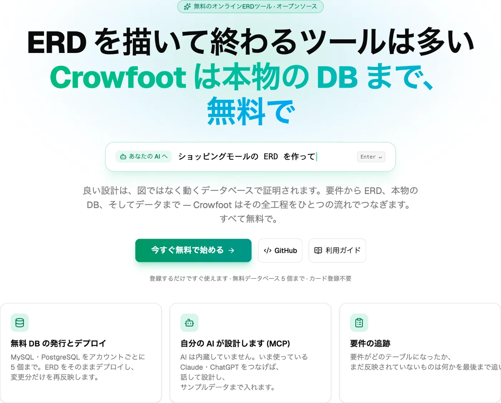
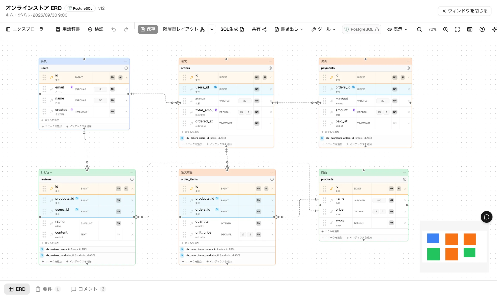
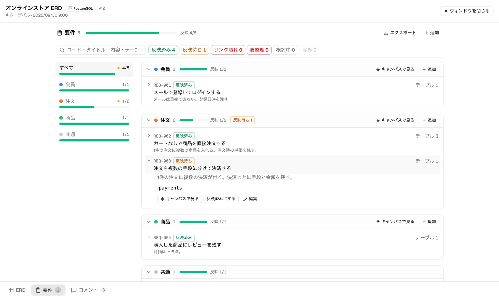
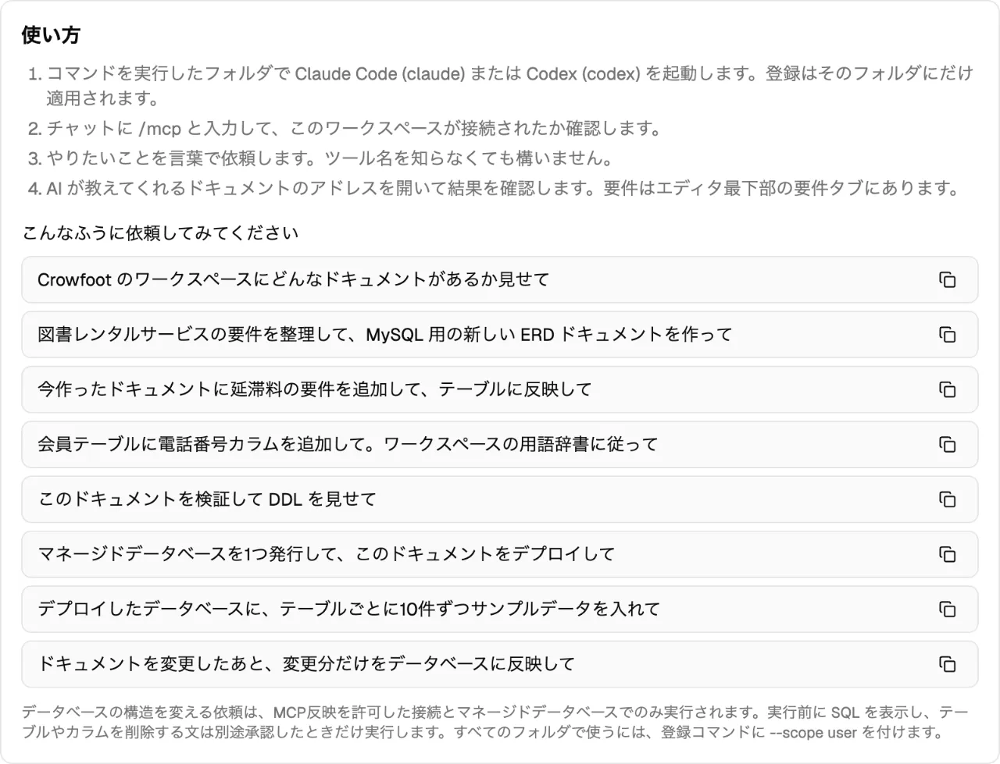
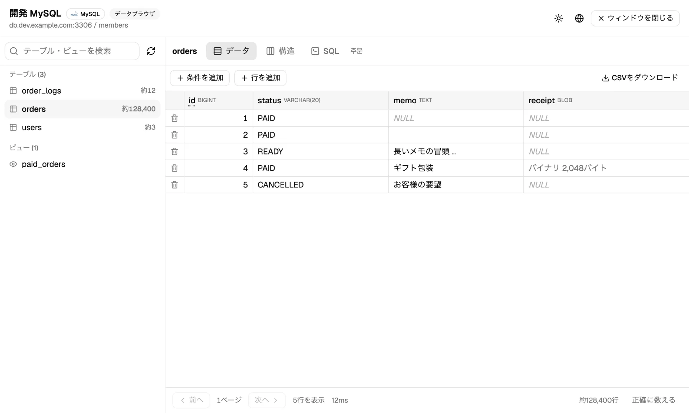
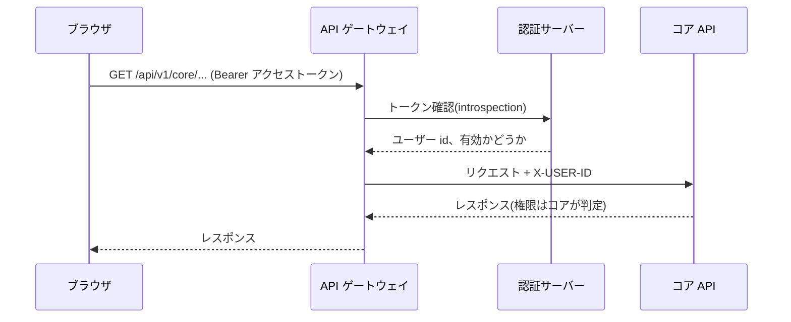
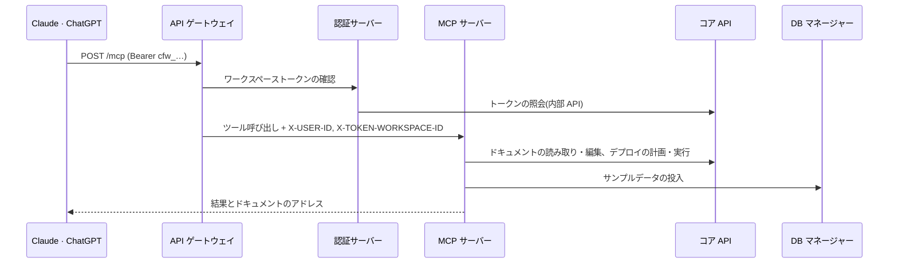
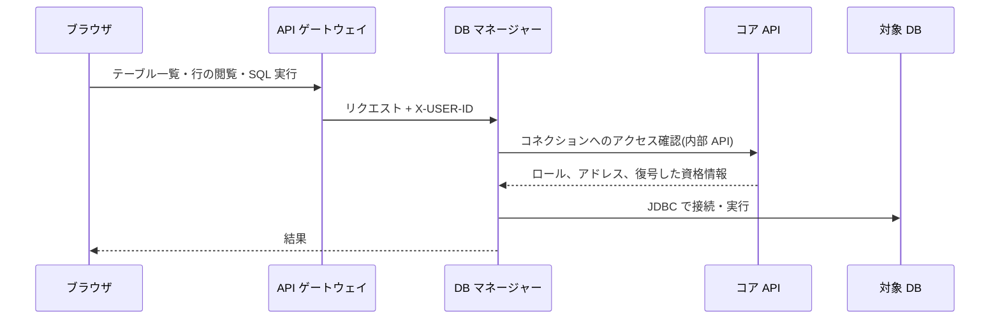

<div align="center">

🌐 **[한국어](./README.md)** | **[English](./README.en.md)** | **日本語** | **[简体中文](./README.zh.md)**


# Crowfoot

**ERD を描いて終わるツールは多くあります。Crowfoot は本物のデータベースまで進みます。**

要件 → ERD → 本物のデータベース → データまで、ブラウザひとつでつなぐオープンソースの ERD プラットフォーム

[](https://www.apache.org/licenses/LICENSE-2.0)
[](https://crowfoot.java21.net/release-notes/35)
[](https://crowfoot.java21.net)
[](https://crowfoot.java21.net/guide#20.1)

[今すぐ使う](https://crowfoot.java21.net) · [利用ガイド](https://crowfoot.java21.net/guide) · [リリースノート](https://crowfoot.java21.net/release-notes) · [共有 ERD を見る](https://crowfoot.java21.net/shared)

</div>

<p align="center">
  
</p>

名前は、テーブル間のリレーションをカラスの足の形をした記号で描く**カラスの足(Crow's Foot)表記法**に由来します。

## 目次

- [Crowfoot を選ぶ理由](#crowfoot-を選ぶ理由)
- [クイックスタート](#クイックスタート)
- [主な機能](#主な機能)
- [アーキテクチャ](#アーキテクチャ)
- [リポジトリ](#リポジトリ)
- [自分で動かす](#自分で動かす)
- [技術スタック](#技術スタック)
- [リリース](#リリース)
- [コントリビュート](#コントリビュート)
- [ライセンス](#ライセンス)

## Crowfoot を選ぶ理由

| | 一般的な ERD ツール | Crowfoot |
| --- | --- | --- |
| 成果物 | 図、DDL ファイル | 図・DDL に加えて**実際に動くデータベース** |
| データベース | 自分で用意 | MySQL・PostgreSQL の開発用 DB を**無料で発行**(ワークスペースごとにユーザーあたり 5 個) |
| 変更の反映 | DDL を手で実行 | ドキュメントと DB の差分を計算し、**マイグレーション SQL を生成して実行**。削除文は別途承認 |
| AI | なし、またはツールに組み込まれた AI | **お使いの Claude・ChatGPT を MCP で接続**。Crowfoot 自体に AI は入っていません |
| 要件 | 別のドキュメント | 要件を ERD と一緒に保存し、**どのテーブルが実装しているかをトレース** |
| データ | 別のツールで確認 | **データブラウザ**で閲覧・編集・SQL 実行、サンプルデータの投入 |
| コラボレーション | ファイル共有 | **リアルタイム同時編集**、コメント、バージョン履歴、共有リンク |

## クイックスタート

### サービスとしてすぐに使う

1. https://crowfoot.java21.net で GitHub または Google アカウントでログインします。
2. ワークスペースを作成し、ERD ドキュメントを開きます。空のドキュメントから始めることも、SQL スクリプトをインポートすることも、既存のデータベースを読み込んで ERD にすることもできます。
3. **データベース**タブで無料の MySQL・PostgreSQL を発行し、ドキュメントをデプロイします。

### Claude・ChatGPT と接続する(MCP)

ワークスペースの **MCP** タブでトークンを発行すると、トークン入りの登録コマンドが表示されます。

```bash
claude mcp add --transport http crowfoot https://crowfoot-mcp.java21.net/mcp \
  --header "Authorization: Bearer <発行したトークン>"
```

あとは会話で作業を任せます。

```text
> 図書レンタルサービスの要件を整理して ERD にして
> 無料の MySQL を発行してデプロイして
> テーブルごとにサンプルデータを 10 件ずつ入れて
```

AI が作った結果はそのまま Crowfoot の画面に表示され、画面で直した内容は AI が読み直します。詳しい手順は[利用ガイド 20 節](https://crowfoot.java21.net/guide#20.1)をご覧ください。

## 主な機能

<table>
<tr>
<td width="50%"><br/><b>ERD エディタ</b> — カラスの足表記、自動レイアウト、グループ、メモ</td>
<td width="50%"><br/><b>要件のトレース</b> — ドメイン別の進捗、根拠のないテーブル</td>
</tr>
<tr>
<td width="50%"><br/><b>AI 連携(MCP)</b> — 接続コマンドと依頼の例</td>
<td width="50%"><br/><b>データブラウザ</b> — 閲覧、行の編集、SQL コンソール</td>
</tr>
</table>

### 設計

- **ブラウザ ERD エディタ** — インストール不要ですぐに使えます。テーブル・カラム・キー・インデックス・リレーションをカラスの足表記で描き、大きなドキュメントも自動レイアウト(階層型・ハブ中心・ハイブリッド)で整理します。
- **論理モデルと物理モデル** — 論理名と物理名をまとめて管理し、共通の型を DBMS ごとの型に変換します。対象 DBMS は MySQL・PostgreSQL・Oracle・SQL Server です。
- **標準辞書** — 単語・用語辞書とドメインタイプで名前と型を揃えます。論理名から物理名を提案し、ドメインタイプを変更すると、それを使うカラムにも反映します。
- **設計検証** — 名前の重複、FK の型の不一致、主キーなしといった 17 種類のルールを常時チェックします。
- **要件** — 要件をドキュメントに一緒に保存し、テーブルとリンクします。内容が変わると「反映待ち」と表示し、ドメイン別の進捗・受け入れ基準・Markdown/CSV エクスポートを提供します。

### データベース

- **無料のマネージドデータベース** — MySQL・PostgreSQL の開発用 DB をボタンひとつで発行します。発行ごとにそのスキーマだけに権限を持つ専用アカウントを作成し、インスタンスの管理者アカウントはどこにも渡しません。
- **SQL 生成とデプロイ** — ドキュメントを DBMS ごとの DDL にし、接続した DB にそのままデプロイします。
- **リバースエンジニアリング** — 既存の DB を読み込むか SQL スクリプトをインポートして、ERD ドキュメントを作ります。
- **マイグレーション** — ドキュメントと DB の差分を再計算して変更 SQL を生成し、実行します。テーブル・カラムを削除する文は既定では実行しません。
- **データブラウザ** — 接続した DB のデータを閲覧・絞り込み・並べ替えし、行を編集し、SQL を実行します。

### コラボレーションと共有

- **リアルタイムコラボレーション** — 複数人で同じドキュメントを同時に編集します。接続中のメンバー、カーソル、選択がリアルタイムで見えます。
- **ワークスペースとチーム** — オーナー・編集者・コメント投稿者・閲覧者の権限でユーザーとチームを招待します。
- **バージョン履歴** — 保存するたびにバージョンが残り、2 つのバージョンを比較したり元に戻したりできます。
- **共有** — リンクで読み取り専用の共有をし、いいね・コメントを受け取ります。共有されたドキュメントは[共有 ERD 一覧](https://crowfoot.java21.net/shared)で誰でも見られます。
- **ERD ライブラリ** — 実務テーマ 500 種類あまりのサンプル ERD を、要件と設計の解説付きで公開しています。

### その他

- **4 言語** — 韓国語・英語・日本語・中国語の画面と利用ガイド
- **AI 連携(MCP)** — ツール 20 種類: ドキュメントの読み取り・作成、要件・スキーマの反映、DB の発行・デプロイ・マイグレーション、サンプルデータ。発行・デプロイ・反映はまず計画を示し、承認したものだけを実行します。
- **管理コンソール** — ユーザー、コードテーブル、マネージド DB インスタンス、発行上限、監査ログ、トラフィック統計

## アーキテクチャ

Crowfoot は 7 つのサービスからなるマイクロサービスです。外から入る HTTP リクエストはすべて API ゲートウェイを通り、サービス同士はクラスター内の内部呼び出しだけでつながります。


### サービス

| サービス | 役割 | ストレージ | 依存先 |
| --- | --- | --- | --- |
| **crowfoot-web** | React SPA。エディタ、ダッシュボード、管理コンソール、公開ページ | — | gateway, collab |
| **crowfoot-api-gateway** | すべての HTTP リクエストの入口。パス・ホストによるルーティング、トークン確認、公開パスの許可リスト、ユーザー識別ヘッダー(`X-USER-ID` など)の注入 | — | auth |
| **crowfoot-auth** | GitHub・Google OAuth2 ログイン(PKCE)、JWT の発行・更新、トークン確認(introspection)、ログアウトのブラックリスト | Redis | core(会員・ワークスペーストークン) |
| **crowfoot-core-api** | ドメインの中心。会員・ワークスペース・チーム・ドキュメント・要件・コメント、SQL 生成・デプロイ・リバースエンジニアリング・マイグレーション、マネージド DB の発行、監査ログ | PostgreSQL | マネージド DB インスタンス、ユーザー DB |
| **crowfoot-collab** | リアルタイムコラボレーション。WebSocket(STOMP)のルームで接続状況と編集内容を中継 | メモリ | auth, core |
| **crowfoot-database-manager** | データブラウザ。閲覧・行の編集・SQL コンソール・サンプルデータ。自前の DB を持たずリクエストごとに接続 | — | core(権限・接続情報) |
| **crowfoot-mcp** | MCP サーバー。Claude・ChatGPT のツール呼び出しを core・DB マネージャーへの呼び出しに変換 | — | core, database-manager |

### リクエストの流れ

**ログインと API 呼び出し** — アクセストークンはブラウザのメモリにだけ置き、リフレッシュトークンは `SameSite=Strict` クッキーに置きます。ゲートウェイはリクエストごとに認証サーバーにトークンを確認します。



**AI 連携(MCP)** — ワークスペーストークン(`cfw_…`)は発行した人の権限で、そのワークスペースの中でだけ使えます。トークンで通れるのは MCP のパスだけで、通常の API はブロックされます。



**データブラウザ** — DB マネージャーは接続情報を保存しません。リクエストごとにコア API から権限と接続情報を受け取り、対象の DB に接続します。



**リアルタイムコラボレーション** — ブラウザはコラボレーションサーバーに WebSocket で直接接続します。コラボレーションサーバーは接続時にトークンとドキュメントの権限を確認し、ルーム内の変更を順番に中継します。ドキュメントの保存はコア API への HTTP 保存で行い、同時保存はバージョン比較で防ぎます。

### セキュリティとデータ保護

- **パスワードの暗号化** — コネクションのパスワードと発行アカウントのパスワードは AES-256-GCM で暗号化して保存します。
- **権限の判定はコアで** — 他のサービスは権限を自分で判断せず、コア API に問い合わせます。他人のリソースは 404 を返し、存在そのものを隠します。
- **発行アカウントの分離** — マネージド DB は発行ごとにそのスキーマだけに権限を持つアカウントを作成し、取り消すとスキーマとアカウントをまとめて削除します。
- **内部アドレスでの接続** — 本番環境のサーバーは、マネージド DB にクラスター内の内部アドレスで接続します。ユーザーには外部から使えるアドレスを表示します。
- **監査ログ** — 発行・取り消し・デプロイ・マイグレーション・接続情報の閲覧といった重要な操作を記録します。

### デプロイ

GitOps でデプロイします。サービスリポジトリの `main` に push すると、GitHub Actions がテストしてイメージをビルドし、GHCR に push したあと、デプロイリポジトリのイメージタグを更新します。Argo CD がその変更を Kubernetes クラスターに反映します。本番サーバーはすべて 8080 ポートで起動し、シークレットは環境変数でのみ渡します。

## リポジトリ

| リポジトリ | 説明 |
| --- | --- |
| [crowfoot-web](https://github.com/crowfoot-erd/crowfoot-web) | フロントエンド — React SPA。ERD エディタ(React Flow)、ダッシュボード・ワークスペース・チーム、管理コンソール、コラボレーションクライアント(STOMP)、4 言語・ダークモード、利用ガイド |
| [crowfoot-api-gateway](https://github.com/crowfoot-erd/crowfoot-api-gateway) | API ゲートウェイ — Spring Cloud Gateway。ルーティング、トークン確認、ユーザー識別ヘッダー、公開パスの許可リスト |
| [crowfoot-auth](https://github.com/crowfoot-erd/crowfoot-auth) | 認証サーバー — OAuth2 ログイン(GitHub・Google・PKCE)、JWT の発行・更新・確認、ワークスペーストークンの確認、Redis ブラックリスト |
| [crowfoot-core-api](https://github.com/crowfoot-erd/crowfoot-core-api) | コア API — 会員・ワークスペース・チーム・ドキュメント・要件・コメント、マネージド DB の発行・取り消し、SQL 生成・デプロイ・リバースエンジニアリング・マイグレーション、ドキュメント編集 API、コードテーブル・監査ログ |
| [crowfoot-collab](https://github.com/crowfoot-erd/crowfoot-collab) | コラボレーションサーバー — WebSocket(STOMP)。ドキュメントごとの接続状況と編集内容のリアルタイム中継 |
| [crowfoot-database-manager](https://github.com/crowfoot-erd/crowfoot-database-manager) | DB マネージャー — データの閲覧・行の編集・SQL コンソール・サンプルデータ。自前の DB を持たずリクエストごとに接続し、権限はコア API に問い合わせます |
| [crowfoot-mcp](https://github.com/crowfoot-erd/crowfoot-mcp) | MCP サーバー — Spring AI MCP。要件・ERD の読み書き、DB の発行・デプロイ・マイグレーション、サンプルデータをツールとして提供 |

## 自分で動かす

### 前提条件

| ツール | バージョン | 用途 |
| --- | --- | --- |
| Java (Temurin) | 21 | 6 つのサーバー |
| Maven | 3.9 以上 | サーバーのビルド・実行 |
| Node.js / pnpm | 20.19 以上 / 10 | フロントエンド |
| PostgreSQL | 16 以上 | サービス DB(`crowfoot` データベース、`crowfoot_core` スキーマ) |
| Redis | 6 以上 | ログアウトのブラックリスト |

スキーマは自動では作成されません(`ddl-auto: none`)。先に DDL スクリプトで初期化してください。

### ローカルポート

| サービス | ポート | 備考 |
| --- | --- | --- |
| crowfoot-web (Vite) | 8080 | `/api` へのリクエストをゲートウェイ(8000)へ転送します |
| crowfoot-api-gateway | 8000 | auth・core・database-manager へ、MCP ホストの `/mcp` は MCP サーバーへルーティング |
| crowfoot-auth | 8081 | |
| crowfoot-core-api | 8082 | |
| crowfoot-collab | 8083 | WebSocket — ゲートウェイを経由せず直接接続します |
| crowfoot-database-manager | 8084 | |
| crowfoot-mcp | 8085 | |

### 環境変数

各サーバーはリポジトリルートの `.env-local`(git にはコミットされません)を読み込みます。`.env-local.example` をコピーして値を埋めてください。ゲートウェイ・collab・DB マネージャー・MCP サーバーには追加の値は不要です。

**crowfoot-auth**

| 変数 | 説明 |
| --- | --- |
| `CROWFOOT_AUTH_JWT_SECRET` | JWT HS256 署名鍵 — Base64、32 バイト以上(`openssl rand -base64 48`) |
| `CROWFOOT_AUTH_FLOW_SECRET` | ログインフロークッキー(`auth_flow`)の HMAC-SHA256 署名鍵 — JWT 鍵とは分けて管理します |
| `CROWFOOT_AUTH_GITHUB_CLIENT_ID` / `..._SECRET` | GitHub OAuth アプリの資格情報 |
| `CROWFOOT_AUTH_GOOGLE_CLIENT_ID` / `..._SECRET` | Google OAuth クライアントの資格情報(PKCE) |
| `CROWFOOT_REDIS_PASSWORD` / `CROWFOOT_REDIS_DATABASE` | Redis への接続(ホストは `application-local.yml`) |

OAuth アプリにはリダイレクト URI として `http://localhost:8080/auth/callback` を登録してください。

**crowfoot-core-api**

| 変数 | 説明 |
| --- | --- |
| `DB_URL` | PostgreSQL JDBC URL — `jdbc:postgresql://{host}:5432/crowfoot?currentSchema=crowfoot_core` |
| `DB_USERNAME` / `DB_PASSWORD` | サービス DB のアカウント |
| `CROWFOOT_CONNECTION_SECRET_KEY` | コネクションのパスワードの暗号化鍵 — Base64、32 バイト。ローカルには開発用の既定値があり、本番では必ず指定します |

**crowfoot-web** — 開発では既定値のまま使います(`VITE_API_BASE_URL` を空にして Vite プロキシで同一オリジンを保ちます)。本番ビルドでは `VITE_API_BASE_URL`(ゲートウェイのアドレス)、`VITE_WS_URL`(コラボレーションサーバーのアドレス、`wss://`)、`VITE_MCP_URL`(MCP のアドレス)を指定します。

### 起動

```bash
# 6 つのサーバー — 各リポジトリで(local プロファイルが既定)
mvn spring-boot:run

# フロントエンド
pnpm install
pnpm dev        # http://localhost:8080
```

推奨の順序は auth → core-api → gateway → collab · database-manager · mcp → web です。ゲートウェイは auth が起動していないとトークンを確認できません。

## 技術スタック

### 共通基盤

| 技術 | バージョン | 使う場所 | 理由・役割 |
| --- | --- | --- | --- |
| Java | 21 | 6 つのサーバー | LTS バージョン。レコード、パターンマッチング、仮想スレッドが使える現在の基準です |
| Spring Boot | 4.1 | 6 つのサーバー | すべてのサーバーで同じバージョンに揃え、設定・ロギング・ヘルスチェック(Actuator)の方式を統一します。Kubernetes は Actuator のヘルスチェックでサーバーの状態を確認します |
| Spring Cloud | 2025.1 | gateway, auth, database-manager | ゲートウェイとサービス間呼び出し(OpenFeign, LoadBalancer)のバージョンをひとまとめに管理します |
| Lombok | — | サーバー | コンストラクタやアクセサのような繰り返しのコードを減らします |

### サーバー別

| サーバー | 中核技術 | 採用理由と役割 |
| --- | --- | --- |
| **crowfoot-api-gateway** | Spring Cloud Gateway (WebFlux) | すべての HTTP リクエストの入口です。ノンブロッキング(リアクティブ)方式なので、少ないスレッドで多くのリクエストを中継します。パスとホストでルーティングし(`/api/v1/core/**` → core、MCP ホストの `/mcp` → MCP サーバー)、グローバルフィルターでトークンを認証サーバーに確認したうえでユーザー識別ヘッダー(`X-USER-ID` など)を付けます。ログインなしで開ける公開パスは許可リストで管理します |
| **crowfoot-auth** | Spring Security · OAuth2 Client · spring-security-oauth2-jose · Spring Data Redis · OpenFeign | GitHub・Google ログイン(OAuth2、Google は PKCE)を処理します。アクセストークンは JWT(HS256)として発行・確認し、リフレッシュトークンはクッキーに置きます。ログアウトしたトークンは有効期限までだけ Redis のブラックリストに保持します。会員情報とワークスペーストークンは OpenFeign で core に問い合わせます |
| **crowfoot-core-api** | Spring Web MVC · Spring Data JPA (Hibernate 7) · Querydsl 5.1 · Bean Validation · PostgreSQL/MySQL JDBC · Commons DBCP2 · MaxMind GeoIP2 | ドメインの中心です。JPA で会員・ワークスペース・ドキュメントを保存し、一覧・検索のような動的な条件は Querydsl で型安全に書きます(関連の取得は fetch join で N+1 を防ぎます)。JDBC ドライバーでユーザーのデータベースを読み取って ERD にし(リバースエンジニアリング)、DDL をデプロイし、無料のデータベースを発行します。GeoIP2 は管理者向けトラフィック統計の国別集計に使います |
| **crowfoot-collab** | Spring WebSocket · STOMP · RestClient | リアルタイムコラボレーションサーバーです。ドキュメントごとに STOMP のルームを設け、接続状況・カーソル・編集内容を順番に中継します。接続時に RestClient で auth にトークンを、core にドキュメントの権限を確認します |
| **crowfoot-database-manager** | Spring Web MVC · JDBC (PostgreSQL·MySQL ドライバー) · OpenFeign | データブラウザです。自前の DB を持たず、リクエストごとに対象の DB へ JDBC で接続し、終わったら閉じます。接続情報と権限は OpenFeign で core に問い合わせます。行の編集とサンプルデータは 1 つのトランザクションで投入します |
| **crowfoot-mcp** | Spring AI 2.0 (MCP Server, WebMVC) · RestClient | Claude・ChatGPT のような MCP クライアントの入口です。Spring AI の MCP サーバー(HTTP トランスポート)で 20 種類のツールを公開し、ツール呼び出しを core・database-manager の内部 API 呼び出しに変換します。サーバーの案内文(instructions)で、AI が守るべき作業の順序とルールを伝えます |

### フロントエンド (crowfoot-web)

| 技術 | バージョン | 使う場所と理由 |
| --- | --- | --- |
| React | 19 | 画面全体。コンポーネント単位でエディタ、ダッシュボード、管理コンソールを作ります |
| TypeScript | 6 | ドキュメントの構造や API レスポンスの型をコードで検査します |
| Vite | 8 | 開発サーバーとビルド。ビルド時にサイトマップの生成や公開ページのプリレンダリング(検索への露出)も担います |
| React Router | 7 | 画面遷移と言語別の URL(`/en`, `/ja`, `/zh`) |
| TanStack Query | 5 | サーバーデータの取得・キャッシュ・再取得。一覧と詳細画面のローディング・エラー状態を一貫して扱います |
| Zustand | 5 | エディタのドキュメントの状態、元に戻す・やり直し、パネルの開閉といった画面の状態 |
| React Flow (@xyflow/react) | 12 | ERD キャンバス。テーブルノードとリレーション線を描き、拡大・移動・選択を処理します。リレーション線の経路とカラスの足表記は独自に実装しています |
| elkjs | 0.12 | 自動レイアウト(階層型)。テーブルの位置だけを計算し、リレーション線は独自のルーターが描き直します |
| Zod | 4 | ドキュメント本体(JSON)のスキーマ検証。古いドキュメントも安全に読み込みます |
| Tailwind CSS · shadcn/ui (Radix UI) | 4 · — | スタイルと基本コンポーネント(ダイアログ、メニュー、タブ)。ダークモードとテーマカラーをトークンで管理します |
| i18next · react-i18next | 26 · 17 | 4 言語(韓国語・英語・日本語・中国語)の画面の文言 |
| CodeMirror | 6 | SQL コンソール。シンタックスハイライトとキーワード・テーブル名の自動補完 |
| Toast UI Editor | 3 | コミュニティの投稿、リリースノート、利用ガイドの Markdown の作成・表示 |
| STOMP.js | 7 | リアルタイムコラボレーションのクライアント |
| Recharts | 3 | 管理者向けトラフィック統計のチャート |
| html-to-image | 1 | ERD を PNG 画像として書き出し |

### データとインフラ

| 技術 | 使う場所 | 役割 |
| --- | --- | --- |
| PostgreSQL 16 | core | サービス DB(会員・ワークスペース・ドキュメント・監査ログ、`crowfoot_core` スキーマ)。無料の PostgreSQL を発行するためのインスタンスでもあります |
| MySQL 8 | core, database-manager | 無料の MySQL を発行するためのインスタンス |
| Redis 6 | auth | ログアウトしたアクセストークンのブラックリスト(有効期限までの TTL、AOF で永続化) |
| Docker · GHCR | 6 つのサーバー、web | リポジトリごとにイメージをビルドし、GitHub Container Registry に push します |
| GitHub Actions | 7 つのリポジトリ | main に push するとテストしてイメージをビルドし、デプロイリポジトリのイメージタグを更新します |
| Kubernetes · Argo CD | 本番 | Argo CD がデプロイリポジトリ(`apps/*`)を監視し、クラスターに反映します(GitOps)。サーバーはローリングアップデートで順に入れ替え、無停止でデプロイします |
| nginx | フロント、web | フロントでは TLS を終端し、ホストごとに振り分けます。web コンテナの中では静的ファイルとプリレンダリング済みのページを配信します |

### テスト

| 技術 | 使う場所 | 役割 |
| --- | --- | --- |
| JUnit 5 · Spring Boot Test | 6 つのサーバー | 単体テスト・結合テスト |
| Testcontainers | core, database-manager | 実際の PostgreSQL・MySQL コンテナで SQL 生成、リバースエンジニアリング、データ編集を検証します |
| MockWebServer · embedded-redis | gateway, auth, collab | 他のサービスや Redis を模倣して、サービス間の呼び出しを検証します |
| Vitest · Testing Library | web | 画面とロジックのテスト(約 1,300 件) |
| MSW | web | モック API サーバー。テストと利用ガイドの画像撮影に使います |
| Playwright | web | 実際のブラウザでの確認と、利用ガイド・リリースノートの画像撮影 |

## リリース

バージョンごとに[リリースノート](https://crowfoot.java21.net/release-notes)を 4 言語で公開しています。各バージョンはサービスリポジトリ 7 つすべてに同じ git タグ(`vX.Y`)で残します — 変更のなかったリポジトリにも、システムのバージョンを揃えるためのタグを付けます。

| バージョン | 日付 | 主な内容 | リリースノート |
| --- | --- | --- | --- |
| v1.33 | 2026-10-03 | サイト全体のデザイン統一（基本色・メニュー・タイトル）、利用ガイドの改善（同じ比率の画像・説明の補足・4言語の校正）、リリースノート33件の改善、ローカルでも無料DBの発行・回収 | [見る](https://crowfoot.java21.net/release-notes/35) |
| v1.32 | 2026-10-03 | AI 連携の拡張(サンプルデータ投入、ドキュメントのアドレス案内、削除文は既定で除外)、要件のドメイン別整理(進捗・検索・エクスポート・受け入れ基準)、共有ドキュメント一覧・目次付きリリースノート、新しいスタートページ、新バージョンの案内 | [見る](https://crowfoot.java21.net/release-notes/34) |
| v1.31 | 2026-10-02 | Claude 連携(MCP — ワークスペーストークンで Claude Code を接続、会話で要件・ERD を作成)、要件パネル(テーブルのリンク・反映待ち表示)、開くときの自動配置、接続ごとの MCP 反映許可 | [見る](https://crowfoot.java21.net/release-notes/33) |
| v1.30 | 2026-10-02 | 用語とドメインタイプの連携、カラム名の候補を用語と単語に区分、標準パネルの統合、利用ガイド(4 言語の画面・検索) | [見る](https://crowfoot.java21.net/release-notes/32) |
| v1.29 | 2026-10-02 | ドメインタイプ(共通の型定義・変更反映のプレビュー)、別のドキュメントへ貼り付け、リレーションのカラムマッピング編集、自動配置の向き | [見る](https://crowfoot.java21.net/release-notes/31) |

<details>
<summary>以前のバージョン（v1.08 ～ v1.28）</summary>

| バージョン | 日付 | 主な内容 | リリースノート |
| --- | --- | --- | --- |
| v1.28 | 2026-10-01 | データブラウザ(閲覧・絞り込み・並べ替え・CSV)、行の編集(まとめて一括適用・競合検知)、SQLコンソール(シンタックスハイライト・自動補完) | [見る](https://crowfoot.java21.net/release-notes/30) |
| v1.27 | 2026-10-01 | 別のDBMSに複製、エディタツールバーの整理、ドキュメント一覧の操作メニュー、ランディング・ログイン画面の刷新 | [見る](https://crowfoot.java21.net/release-notes/29) |
| v1.26 | 2026-09-30 | ドキュメントのDB接続、マイグレーションDDLのDB反映(実行時再計算・文ごとのレポート) | [見る](https://crowfoot.java21.net/release-notes/28) |
| v1.25 | 2026-09-29 | ERDライブラリ公開(実務主題509種)、レイアウト間隔のバランス調整 | [見る](https://crowfoot.java21.net/release-notes/27) |
| v1.24 | 2026-09-29 | 自動レイアウト3モード、ドラッグ中のリレーション線リアルタイム再ルーティング、1:1リレーションへのユニークキー自動生成、文書一覧ページング | [見る](https://crowfoot.java21.net/release-notes/26) |
| v1.23 | 2026-09-28 | リリースノート画像改善、デプロイ手順の文書化 — 機能変更なし | [見る](https://crowfoot.java21.net/release-notes/25) |
| v1.22 | 2026-09-28 | 通知(ヘッダーのベル・3種のイベント・通知一覧ページ) | [見る](https://crowfoot.java21.net/release-notes/24) |
| v1.21 | 2026-09-28 | ドキュメント単位のフィードバック(いいね・匿名コメント・作成者返信)、公開ビューからのSQL書き出し | [見る](https://crowfoot.java21.net/release-notes/23) |
| v1.20 | 2026-09-27 | 設計検証(17ルール)、FKインデックス自動生成 | [見る](https://crowfoot.java21.net/release-notes/22) |
| v1.19 | 2026-09-27 | 管理者トラフィック統計 | [見る](https://crowfoot.java21.net/release-notes/21) |
| v1.18 | 2026-09-27 | テンプレートショーケース、統合共有ギャラリー、共有SEO、空キャンバスのオンボーディング | [見る](https://crowfoot.java21.net/release-notes/20) |
| v1.17 | 2026-09-26 | コラボレーション強化(カーソル・選択・移動、同時編集の収束、編集ロック) | [見る](https://crowfoot.java21.net/release-notes/19) |
| v1.16 | 2026-09-25 | 4言語の完全対応、言語別URL・SEO | [見る](https://crowfoot.java21.net/release-notes/18) |
| v1.15 | 2026-09-25 | システム辞書の拡張(標準トークン34,075個) | [見る](https://crowfoot.java21.net/release-notes/17) |
| v1.14 | 2026-09-25 | 用語辞書パネル、カラム物理名の辞書サジェスト | [見る](https://crowfoot.java21.net/release-notes/16) |
| v1.13 | 2026-09-24 | 論理グループ(主題領域)、論理名自動推論、ショートカットチートシート | [見る](https://crowfoot.java21.net/release-notes/15) |
| v1.12 | 2026-09-23 | モデルエクスプローラ·統合検索、SQLインポート | [見る](https://crowfoot.java21.net/release-notes/14) |
| v1.11 | 2026-09-22 | リレーションシップ編集·バージョン比較の改善、画像エクスポート高速化 | [見る](https://crowfoot.java21.net/release-notes/13) |
| v1.10 | 2026-09-21 | バージョン比較·マイグレーションDDL | [見る](https://crowfoot.java21.net/release-notes/11) |
| v1.09 | 2026-09-20 | ドキュメントのバージョン履歴·DB同期 | [見る](https://crowfoot.java21.net/release-notes/10) |
| v1.08 | 2026-09-18 | コミュニティ掲示板·リアルタイムチャット·エディタの安全装置 | [見る](https://crowfoot.java21.net/release-notes/9) |

</details>

## コントリビュート

バグ報告、機能の提案、プルリクエストをどれも歓迎します。

- **バグ・提案** — 該当するリポジトリの Issue に登録してください。どのリポジトリかわからない場合は [crowfoot-web](https://github.com/crowfoot-erd/crowfoot-web/issues) に登録してください。再現手順、期待した動作、実際の動作、スクリーンショットがあると早く修正できます。
- **プルリクエスト** — 変更の範囲を小さく分け、テストも一緒に含めてください。サーバーは `mvn test`、フロントエンドは `pnpm vitest run` と `pnpm build` が通る必要があります。
- **画面が変わる変更** — 利用ガイド(4 言語)の説明と画像もあわせて更新してください。
- **セキュリティの問題** — 公開の Issue ではなく、まずリポジトリの管理者にお知らせください。

## ライセンス

すべてのリポジトリは [Apache License 2.0](https://www.apache.org/licenses/LICENSE-2.0) で配布されています。
