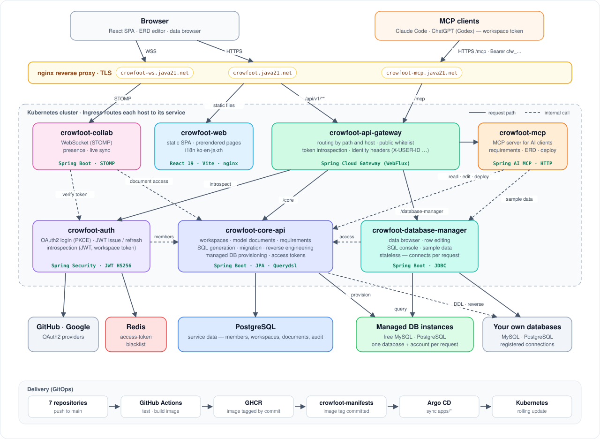

# Crowfoot

[](https://www.apache.org/licenses/LICENSE-2.0)

**[한국어](./README.md)** | **[English](./README.en.md)** | **日本語** | **[简体中文](./README.zh.md)**

**設計が終わったら、データベースが始まります。**

Crowfootはブラウザで動作するオープンソースのERDエディタです。論理モデルの設計から物理モデルへの変換、チーム協業、そして実際のデータベース発行まで — データ作業の最初から最後までを一箇所で提供します。Crowfootという名前は、テーブル間のリレーションシップをカラスの足跡のような記号で表す**カラスの足(Crow's Foot)表記法**に由来します。

## サービス

| 種類 | アドレス |
| --- | --- |
| ウェブ(エディタ·ダッシュボード) | https://crowfoot.java21.net |
| APIゲートウェイ | https://crowfoot-api.java21.net |
| 協業WebSocketサーバー | ws://crowfoot-ws.java21.net |
| システムERD | https://crowfoot.java21.net/share/1KeFkNED0uTmx6MPWqmXph |

Crowfootシステム自身のERDもCrowfootで設計しました — 上の共有リンクから確認できます。

## 無料マネージドデータベース

Crowfootの核となる機能です。**アカウントごとに最大5個まで**、PostgreSQL·MySQLの開発用データベースを**無料で発行**できます。

- 発行時に**専用DBアカウントが自動生成**されます — スキーマ限定の権限を持つアカウントで、インスタンスのroot資格情報はどこにも露出しません
- 発行されたパスワードはAES-256-GCMで暗号化して保管し、所有者のみが接続情報を閲覧できます
- 発行直後に接続テストを行い、外部クライアントからすぐに利用できます。不要になれば取り消せます
- 開発·学習·テスト用途のデータベースです

## 機能

### ブラウザERDエディタ

- インストール不要 — ブラウザでそのまま、カラスの足表記でテーブルとリレーションシップを描けます
- **論理モデルと物理モデルを同時に** — 論理名·物理名を並べて表示し、共通論理型をDBMS固有の物理型に自動マッピング
- **5種のDBMSテンプレート** — PostgreSQL、MySQL、Oracle、MSSQL(+共通)。それぞれの型·自動採番·コメント構文を反映
- モデル検証(名前重複·参照整合性など)、自動レイアウト、ドキュメントごとのビューポート(ズーム·パン)記憶
- 大規模ドキュメント(テーブル100個)でも滑らかな60fpsのパン·ズーム

### SQL生成·デプロイ·リバースエンジニアリング

- ドキュメントを**DBMS向けのDDLスクリプト**に変換 — プレビュー·コピー·ダウンロード(テーブルコメントは論理名に従います)
- **フォワードエンジニアリング** — 生成したDDLを発行済みまたは登録済みのデータベースにそのままデプロイ
- **リバースエンジニアリング** — 既存データベースのスキーマとコメントをERDドキュメントとして読み込み

### リアルタイム協業

- WebSocket(STOMP)ベース — 同じドキュメントを複数人で編集、ライブプレゼンスと変更のリアルタイム同期
- ドキュメントにコメントを残せます

### ワークスペースとチームロール

- ドキュメントをワークスペースで整理し、ユーザーやチームを招待
- ロールベースの権限 — **Owner、Editor、Commenter、Viewer** — チームの作業を安全に保ちます

**自分のデータベースを持ってくる**

- 既存データベースの接続プロファイルを(暗号化して)保存し、ワンクリックでテスト
- マネージドDBと個人DBを一つのリストで管理

### 認証と管理

- **GitHub·Google OAuth2ログイン** — アクセストークンはメモリ内、リフレッシュトークンは`SameSite=Strict`クッキーで保持し、ゲートウェイでリクエストごとにintrospection検証
- 管理コンソール — ユーザー、コードテーブル、マネージドDBインスタンス、発行クォータ、監査ログの管理

## アーキテクチャ

7つのサービスからなる MSA です。外からのリクエストはすべてゲートウェイを通り、サービス同士は内部呼び出しだけでつながります。



- **入口は 3 つです。** 画面(`crowfoot.java21.net`)、リアルタイムコラボレーション(`crowfoot-ws.java21.net`、WebSocket)、AI 連携(`crowfoot-mcp.java21.net`、MCP)
- **ゲートウェイが身元を確認します。** ログイントークンとワークスペーストークンを認証サーバーに問い合わせ、確認できたユーザー情報をヘッダーに載せて後ろへ渡します
- **コア API が中心です。** ドキュメントと権限を持ち、認証サーバー・コラボレーションサーバー・DB マネージャー・MCP サーバーがすべてコア API に問い合わせます
- **データベースに触れるサービスは 2 つです。** コア API は無料データベースを発行して DDL を実行し、DB マネージャーはデータを閲覧・編集します
- **デリバリーは GitOps です。** main に push すると GitHub Actions がイメージを作り、Argo CD がクラスターに反映します

## リポジトリ

| リポジトリ | 説明 |
| --- | --- |
| [crowfoot-web](https://github.com/crowfoot-erd/crowfoot-web) | フロントエンド — React SPA。ERDエディタ(React Flow)、ダッシュボード·ワークスペース·チーム、管理コンソール、協業クライアント(STOMP)、i18n(ko·en·ja·zh)·ダークモード |
| [crowfoot-api-gateway](https://github.com/crowfoot-erd/crowfoot-api-gateway) | APIゲートウェイ — Spring Cloud Gateway。ルーティング、Bearerトークンのintrospection検証、ユーザー識別ヘッダー注入、公開パスのホワイトリスト |
| [crowfoot-auth](https://github.com/crowfoot-erd/crowfoot-auth) | 認証サーバー — OAuth2ログイン(GitHub·Google·PKCE)、JWT発行·更新·introspection、Redisブラックリスト(ログアウト) |
| [crowfoot-core-api](https://github.com/crowfoot-erd/crowfoot-core-api) | コアAPI — ユーザー·ワークスペース·チーム·モデルドキュメント·コメント、マネージドDBプロビジョニング(専用アカウントの発行·取り消し)、SQL生成·デプロイ·リバースエンジニアリング、コードテーブル·監査ログ |
| [crowfoot-collab](https://github.com/crowfoot-erd/crowfoot-collab) | 協業サーバー — WebSocket(STOMP)。ドキュメントごとのプレゼンスと編集変更のリアルタイムブロードキャスト、単一インスタンス運用 |
| [crowfoot-database-manager](https://github.com/crowfoot-erd/crowfoot-database-manager) | DBマネージャー — データブラウザ。コネクションが指すデータベースのデータ閲覧・行の編集・SQLコンソール。自前のDBを持たずリクエストごとに接続し、権限判定はコアAPIに委ねる |
| [crowfoot-mcp](https://github.com/crowfoot-erd/crowfoot-mcp) | MCP サーバー — Claude のような MCP クライアントの入口。要件・ERD の読み書きとデータベースへの反映をツールとして提供。自前のストレージを持たず、ツール呼び出しをコア API に渡す |

## リリース

| バージョン | 日付 | 主な内容 | タグ | リリースノート |
| --- | --- | --- | --- | --- |
| v1.32 | 2026-10-03 | AI 連携の拡張(サンプルデータ投入、ドキュメントのアドレス案内、削除文は既定で除外)、要件のドメイン別整理(進捗・検索・エクスポート・受け入れ基準)、共有ドキュメント一覧・目次付きリリースノート、新しいスタートページ、新バージョンの案内 | [crowfoot-web](https://github.com/crowfoot-erd/crowfoot-web/releases/tag/v1.32) · [crowfoot-core-api](https://github.com/crowfoot-erd/crowfoot-core-api/releases/tag/v1.32) · [crowfoot-auth](https://github.com/crowfoot-erd/crowfoot-auth/releases/tag/v1.32) · [crowfoot-collab](https://github.com/crowfoot-erd/crowfoot-collab/releases/tag/v1.32) · [crowfoot-api-gateway](https://github.com/crowfoot-erd/crowfoot-api-gateway/releases/tag/v1.32) · [crowfoot-database-manager](https://github.com/crowfoot-erd/crowfoot-database-manager/releases/tag/v1.32) · [crowfoot-mcp](https://github.com/crowfoot-erd/crowfoot-mcp/releases/tag/v1.32) | [見る](https://crowfoot.java21.net/release-notes/34) |
| v1.31 | 2026-10-02 | Claude 連携(MCP — ワークスペーストークンで Claude Code を接続、会話で要件・ERD を作成)、要件パネル(テーブルのリンク・反映待ち表示)、開くときの自動配置、接続ごとの MCP 反映許可 | [crowfoot-web](https://github.com/crowfoot-erd/crowfoot-web/releases/tag/v1.31) · [crowfoot-core-api](https://github.com/crowfoot-erd/crowfoot-core-api/releases/tag/v1.31) · [crowfoot-auth](https://github.com/crowfoot-erd/crowfoot-auth/releases/tag/v1.31) · [crowfoot-collab](https://github.com/crowfoot-erd/crowfoot-collab/releases/tag/v1.31) · [crowfoot-api-gateway](https://github.com/crowfoot-erd/crowfoot-api-gateway/releases/tag/v1.31) · [crowfoot-database-manager](https://github.com/crowfoot-erd/crowfoot-database-manager/releases/tag/v1.31) · [crowfoot-mcp](https://github.com/crowfoot-erd/crowfoot-mcp/releases/tag/v1.31) | [見る](https://crowfoot.java21.net/release-notes/33) |
| v1.30 | 2026-10-02 | 用語とドメインタイプの連携(用語がドメインタイプを指す・ドメインタイプにする)、カラム名の候補を用語と単語に区分、標準パネルの統合(辞書・ドメインタイプ・システム辞書)、利用ガイド(20 節・4 言語の画面・検索) | [crowfoot-web](https://github.com/crowfoot-erd/crowfoot-web/releases/tag/v1.30) · [crowfoot-core-api](https://github.com/crowfoot-erd/crowfoot-core-api/releases/tag/v1.30) · [crowfoot-auth](https://github.com/crowfoot-erd/crowfoot-auth/releases/tag/v1.30) · [crowfoot-collab](https://github.com/crowfoot-erd/crowfoot-collab/releases/tag/v1.30) · [crowfoot-api-gateway](https://github.com/crowfoot-erd/crowfoot-api-gateway/releases/tag/v1.30) · [crowfoot-database-manager](https://github.com/crowfoot-erd/crowfoot-database-manager/releases/tag/v1.30) | [見る](https://crowfoot.java21.net/release-notes/32) |
| v1.29 | 2026-10-02 | ドメインタイプ(複数のカラムが共有する型定義・個別の差異・変更反映のプレビュー)、別のドキュメントへ貼り付け(右クリックのコピー・複製・貼り付け)、リレーションのカラムマッピング編集、自動配置の向き(左から右)・計算中の画面停止を解消 | [crowfoot-web](https://github.com/crowfoot-erd/crowfoot-web/releases/tag/v1.29) · [crowfoot-core-api](https://github.com/crowfoot-erd/crowfoot-core-api/releases/tag/v1.29) · [crowfoot-auth](https://github.com/crowfoot-erd/crowfoot-auth/releases/tag/v1.29) · [crowfoot-collab](https://github.com/crowfoot-erd/crowfoot-collab/releases/tag/v1.29) · [crowfoot-api-gateway](https://github.com/crowfoot-erd/crowfoot-api-gateway/releases/tag/v1.29) · [crowfoot-database-manager](https://github.com/crowfoot-erd/crowfoot-database-manager/releases/tag/v1.29) | [見る](https://crowfoot.java21.net/release-notes/31) |
| v1.28 | 2026-10-01 | データブラウザ(接続したデータベースのデータ閲覧・絞り込み・並べ替え・CSV)、行の編集(まとめて一括適用・競合検知)、SQLコンソール(シンタックスハイライト・自動補完・書き込み文の確認)、ERDエディタからテーブルのデータを直接開く | [crowfoot-web](https://github.com/crowfoot-erd/crowfoot-web/releases/tag/v1.28) · [crowfoot-core-api](https://github.com/crowfoot-erd/crowfoot-core-api/releases/tag/v1.28) · [crowfoot-auth](https://github.com/crowfoot-erd/crowfoot-auth/releases/tag/v1.28) · [crowfoot-collab](https://github.com/crowfoot-erd/crowfoot-collab/releases/tag/v1.28) · [crowfoot-api-gateway](https://github.com/crowfoot-erd/crowfoot-api-gateway/releases/tag/v1.28) · [crowfoot-database-manager](https://github.com/crowfoot-erd/crowfoot-database-manager/releases/tag/v1.28) | [見る](https://crowfoot.java21.net/release-notes/30) |
| v1.27 | 2026-10-01 | 別のDBMSに複製(対象DBMSだけが異なる新しいドキュメント・チェック結果のプレビュー)、エディタツールバーの整理(ボタン8個 + 書き出し・ツールメニュー)、ドキュメント一覧の操作メニュー・DB種類の表示名、ランディング・ログイン画面の刷新、日別ログイン集計のバグ修正 | [crowfoot-web](https://github.com/crowfoot-erd/crowfoot-web/releases/tag/v1.27) · [crowfoot-core-api](https://github.com/crowfoot-erd/crowfoot-core-api/releases/tag/v1.27) · [crowfoot-auth](https://github.com/crowfoot-erd/crowfoot-auth/releases/tag/v1.27) · [crowfoot-collab](https://github.com/crowfoot-erd/crowfoot-collab/releases/tag/v1.27) · [crowfoot-api-gateway](https://github.com/crowfoot-erd/crowfoot-api-gateway/releases/tag/v1.27) | [見る](https://crowfoot.java21.net/release-notes/29) |
| v1.26 | 2026-09-30 | ドキュメントのDB接続(手描きドキュメントを後からコネクションに紐付け)、マイグレーションDDLのDB反映(実行時再計算・取り消し不可の確認ウィンドウ・文ごとのレポート)、サイドバーのワークスペースセクション区別、型表記正規化のバグ修正 | [crowfoot-web](https://github.com/crowfoot-erd/crowfoot-web/releases/tag/v1.26) · [crowfoot-core-api](https://github.com/crowfoot-erd/crowfoot-core-api/releases/tag/v1.26) · [crowfoot-auth](https://github.com/crowfoot-erd/crowfoot-auth/releases/tag/v1.26) · [crowfoot-collab](https://github.com/crowfoot-erd/crowfoot-collab/releases/tag/v1.26) · [crowfoot-api-gateway](https://github.com/crowfoot-erd/crowfoot-api-gateway/releases/tag/v1.26) | [見る](https://crowfoot.java21.net/release-notes/28) |
| v1.25 | 2026-09-29 | ERDライブラリ公開(実務主題509種 — 要件・キー・整合性設計の解説付き)、レイアウト間隔のバランス調整(テーブルはゆったり、クラスタは近く)、メモ縦重なり修正 | [crowfoot-web](https://github.com/crowfoot-erd/crowfoot-web/releases/tag/v1.25) · [crowfoot-core-api](https://github.com/crowfoot-erd/crowfoot-core-api/releases/tag/v1.25) · [crowfoot-auth](https://github.com/crowfoot-erd/crowfoot-auth/releases/tag/v1.25) · [crowfoot-collab](https://github.com/crowfoot-erd/crowfoot-collab/releases/tag/v1.25) · [crowfoot-api-gateway](https://github.com/crowfoot-erd/crowfoot-api-gateway/releases/tag/v1.25) | [見る](https://crowfoot.java21.net/release-notes/27) |
| v1.24 | 2026-09-29 | 自動レイアウト3モード(ハブ中心・ハイブリッド放射状を追加)、ドラッグ中のリレーション線リアルタイム再ルーティング、操作改善8件、1:1リレーションへのユニークキー自動生成、テンプレートカードを元の言語で表示、コミュニティメニューの通知、文書一覧ページング、公開中の共有をサイトマップへ自動登録 | [crowfoot-web](https://github.com/crowfoot-erd/crowfoot-web/releases/tag/v1.24) · [crowfoot-core-api](https://github.com/crowfoot-erd/crowfoot-core-api/releases/tag/v1.24) · [crowfoot-auth](https://github.com/crowfoot-erd/crowfoot-auth/releases/tag/v1.24) · [crowfoot-collab](https://github.com/crowfoot-erd/crowfoot-collab/releases/tag/v1.24) · [crowfoot-api-gateway](https://github.com/crowfoot-erd/crowfoot-api-gateway/releases/tag/v1.24) | [見る](https://crowfoot.java21.net/release-notes/26) |
| v1.23 | 2026-09-28 | リリースノート画像改善: 全画面ではなく必要な部分を拡大した要素単位キャプチャ(2×レティナ)、デプロイ手順の文書化 — 機能変更なし | [crowfoot-web](https://github.com/crowfoot-erd/crowfoot-web/releases/tag/v1.23) · [crowfoot-core-api](https://github.com/crowfoot-erd/crowfoot-core-api/releases/tag/v1.23) · [crowfoot-auth](https://github.com/crowfoot-erd/crowfoot-auth/releases/tag/v1.23) · [crowfoot-collab](https://github.com/crowfoot-erd/crowfoot-collab/releases/tag/v1.23) · [crowfoot-api-gateway](https://github.com/crowfoot-erd/crowfoot-api-gateway/releases/tag/v1.23) | [見る](https://crowfoot.java21.net/release-notes/25) |
| v1.22 | 2026-09-28 | 通知: ヘッダーのベル(未読バッジ・30秒ポーリング)、3種のイベント(自分のドキュメントへのコメント・いいね、自分のコメントへの作成者返信)、通知一覧ページ、行クリックでドキュメントへ移動、90日保持 | [web](https://github.com/crowfoot-erd/crowfoot-web/releases/tag/v1.22) · [core](https://github.com/crowfoot-erd/crowfoot-core-api/releases/tag/v1.22) · [auth](https://github.com/crowfoot-erd/crowfoot-auth/releases/tag/v1.22) · [collab](https://github.com/crowfoot-erd/crowfoot-collab/releases/tag/v1.22) · [gateway](https://github.com/crowfoot-erd/crowfoot-api-gateway/releases/tag/v1.22) | [見る](https://crowfoot.java21.net/release-notes/24) |
| v1.21 | 2026-09-28 | 対話: ドキュメント単位のフィードバック(いいね・匿名コメント・作成者返信)、公開ビューのコメントタブ、自分のフィードバックまとめ(自分のコメント・いいね)、公開ビューからのSQL書き出し、DBMS別FKインデックスポリシー | [web](https://github.com/crowfoot-erd/crowfoot-web/releases/tag/v1.21) · [core](https://github.com/crowfoot-erd/crowfoot-core-api/releases/tag/v1.21) · [auth](https://github.com/crowfoot-erd/crowfoot-auth/releases/tag/v1.21) · [collab](https://github.com/crowfoot-erd/crowfoot-collab/releases/tag/v1.21) · [gateway](https://github.com/crowfoot-erd/crowfoot-api-gateway/releases/tag/v1.21) | [見る](https://crowfoot.java21.net/release-notes/23) |
| v1.20 | 2026-09-27 | 設計検証ERDリンター: 17ルール(エラー・警告・参考)、常時再計算の検証パネル、リレーションのカラムマッピング表示、FKインデックス自動生成、テンプレート遡及 | [web](https://github.com/crowfoot-erd/crowfoot-web/releases/tag/v1.20) · [core](https://github.com/crowfoot-erd/crowfoot-core-api/releases/tag/v1.20) · [auth](https://github.com/crowfoot-erd/crowfoot-auth/releases/tag/v1.20) · [collab](https://github.com/crowfoot-erd/crowfoot-collab/releases/tag/v1.20) · [gateway](https://github.com/crowfoot-erd/crowfoot-api-gateway/releases/tag/v1.20) | [見る](https://crowfoot.java21.net/release-notes/22) |
| v1.19 | 2026-09-27 | 管理者トラフィック統計: アクセス指標サマリー(PV/UUV/セッション/新規/ボット)、ディメンション分析(国・流入元・ページなど)、共有ドキュメントTOP、ログイン・機能使用量 | [web](https://github.com/crowfoot-erd/crowfoot-web/releases/tag/v1.19) · [core](https://github.com/crowfoot-erd/crowfoot-core-api/releases/tag/v1.19) · [auth](https://github.com/crowfoot-erd/crowfoot-auth/releases/tag/v1.19) · [collab](https://github.com/crowfoot-erd/crowfoot-collab/releases/tag/v1.19) · [gateway](https://github.com/crowfoot-erd/crowfoot-api-gateway/releases/tag/v1.19) | [見る](https://crowfoot.java21.net/release-notes/21) |
| v1.18 | 2026-09-27 | ショーケースと拡散：テンプレートERD 8種、統合共有ギャラリー(人気3+新着15)、共有SEO(プリレンダ・og)、空キャンバスのオンボーディング | [web](https://github.com/crowfoot-erd/crowfoot-web/releases/tag/v1.18) · [core](https://github.com/crowfoot-erd/crowfoot-core-api/releases/tag/v1.18) · [auth](https://github.com/crowfoot-erd/crowfoot-auth/releases/tag/v1.18) · [collab](https://github.com/crowfoot-erd/crowfoot-collab/releases/tag/v1.18) · [gateway](https://github.com/crowfoot-erd/crowfoot-api-gateway/releases/tag/v1.18) | [見る](https://crowfoot.java21.net/release-notes/20) |
| v1.17 | 2026-09-26 | コラボレーション強化：リアルタイムカーソル・選択・移動、同時編集の収束、編集ロック、バージョン競合の解決 | [web](https://github.com/crowfoot-erd/crowfoot-web/releases/tag/v1.17) · [core](https://github.com/crowfoot-erd/crowfoot-core-api/releases/tag/v1.17) · [auth](https://github.com/crowfoot-erd/crowfoot-auth/releases/tag/v1.17) · [collab](https://github.com/crowfoot-erd/crowfoot-collab/releases/tag/v1.17) · [gateway](https://github.com/crowfoot-erd/crowfoot-api-gateway/releases/tag/v1.17) | [見る](https://crowfoot.java21.net/release-notes/19) |
| v1.16 | 2026-09-25 | 4言語の完全対応(韓国語・英語・日本語・中国語)、言語別URL・SEO、アカウント言語、リリースノート多言語化 | [web](https://github.com/crowfoot-erd/crowfoot-web/releases/tag/v1.16) · [core](https://github.com/crowfoot-erd/crowfoot-core-api/releases/tag/v1.16) · [auth](https://github.com/crowfoot-erd/crowfoot-auth/releases/tag/v1.16) · [collab](https://github.com/crowfoot-erd/crowfoot-collab/releases/tag/v1.16) · [gateway](https://github.com/crowfoot-erd/crowfoot-api-gateway/releases/tag/v1.16) | [見る](https://crowfoot.java21.net/release-notes/18) |
| v1.15 | 2026-09-25 | システム辞書の大量拡張(34,075トークン)、推論ローディング改善 | [web](https://github.com/crowfoot-erd/crowfoot-web/releases/tag/v1.15) · [core](https://github.com/crowfoot-erd/crowfoot-core-api/releases/tag/v1.15) | [見る](https://crowfoot.java21.net/release-notes/17) |
| v1.14 | 2026-09-25 | 用語辞書パネル·システム辞書管理、推論の言語選択、カラム物理名の辞書サジェスト | [web](https://github.com/crowfoot-erd/crowfoot-web/releases/tag/v1.14) · [core](https://github.com/crowfoot-erd/crowfoot-core-api/releases/tag/v1.14) | [見る](https://crowfoot.java21.net/release-notes/16) |
| v1.13 | 2026-09-24 | 論理グループ(主題領域)、論理名自動推論、ショートカットチートシート | [web](https://github.com/crowfoot-erd/crowfoot-web/releases/tag/v1.13) · [core](https://github.com/crowfoot-erd/crowfoot-core-api/releases/tag/v1.13) | [見る](https://crowfoot.java21.net/release-notes/15) |
| v1.12 | 2026-09-23 | モデルエクスプローラ·統合検索、SQLインポート | [web](https://github.com/crowfoot-erd/crowfoot-web/releases/tag/v1.12) · [core](https://github.com/crowfoot-erd/crowfoot-core-api/releases/tag/v1.12) | [見る](https://crowfoot.java21.net/release-notes/14) |
| v1.11 | 2026-09-22 | リレーションシップ編集·バージョン比較の改善、画像エクスポート高速化 | — | [見る](https://crowfoot.java21.net/release-notes/13) |
| v1.10 | 2026-09-21 | バージョン比較·マイグレーションDDL | — | [見る](https://crowfoot.java21.net/release-notes/11) |
| v1.09 | 2026-09-20 | ドキュメントのバージョン履歴·DB同期 | — | [見る](https://crowfoot.java21.net/release-notes/10) |
| v1.08 | 2026-09-18 | コミュニティ掲示板·リアルタイムチャット·エディタの安全装置 | — | [見る](https://crowfoot.java21.net/release-notes/9) |

各リリースの変更内容は[リリースノート](https://crowfoot.java21.net/)として公開しています(ランディングの「最近のリリース」に全一覧があります)。gitタグはv1.12から残し始め、v1.16以降は毎リリース、デプロイ対象のリポジトリすべて(v1.28から6つ)に付与しています(変更のないリポジトリも無変更タグでシステムのバージョンを揃えます)。

## 自分で動かす

### 前提条件

| ツール | バージョン | 用途 |
| --- | --- | --- |
| Java (Temurin) | 21 | 4つのサーバー |
| Maven | 3.9+ | サーバーのビルド·実行 |
| Node.js / pnpm | 20 / 10 | フロントエンド |
| PostgreSQL | 16+ | ドメインDB(`crowfoot`データベース + `crowfoot_core`スキーマ) |
| Redis | 6+ | 認証ログアウトのブラックリスト |

スキーマは自動作成されません(`ddl-auto: none`)— DDLスクリプトで初期化してください。

### ローカルポート

| サービス | ポート | 備考 |
| --- | --- | --- |
| crowfoot-web (Vite) | 8080 | `/api`をゲートウェイ(8000)へプロキシ |
| crowfoot-api-gateway | 8000 | `auth`(8081)と`core-api`(8082)へルーティング |
| crowfoot-auth | 8081 | |
| crowfoot-core-api | 8082 | |
| crowfoot-collab | 8083 | WebSocket(STOMP) — ゲートウェイを経由せず直接接続 |

### 環境変数

各サーバーはリポジトリルートの`.env-local`ファイル(gitignore対象)を自動読み込みします — `.env-local.example`をコピーして値を埋めてください。ゲートウェイとcollabに環境変数は不要です。

**crowfoot-auth**

| 変数 | 説明 |
| --- | --- |
| `CROWFOOT_AUTH_JWT_SECRET` | JWT HS256署名鍵 — Base64、32バイト以上(`openssl rand -base64 48`) |
| `CROWFOOT_AUTH_FLOW_SECRET` | `auth_flow`クッキーのHMAC-SHA256鍵 — JWT鍵とは分離 |
| `CROWFOOT_AUTH_GITHUB_CLIENT_ID` / `..._SECRET` | GitHub OAuthアプリの資格情報 |
| `CROWFOOT_AUTH_GOOGLE_CLIENT_ID` / `..._SECRET` | Google OAuthクライアントの資格情報(PKCE) |
| `CROWFOOT_REDIS_PASSWORD` / `CROWFOOT_REDIS_DATABASE` | Redisブラックリスト接続(ホストは`application-local.yml`) |

OAuthアプリにリダイレクトURI `http://localhost:8080/auth/callback` を登録してください。

**crowfoot-core-api**

| 変数 | 説明 |
| --- | --- |
| `DB_URL` | PostgreSQL JDBC URL — `jdbc:postgresql://{host}:5432/crowfoot?currentSchema=crowfoot_core` |
| `DB_USERNAME` / `DB_PASSWORD` | ドメインデータベースアカウント |

**crowfoot-web** — 開発はデフォルトで動作します(`VITE_API_BASE_URL`空 → Viteプロキシで同一オリジン)。本番ビルドでは`VITE_API_BASE_URL`(APIゲートウェイ)と`VITE_WS_URL`(協業WS)を注入します。

### 起動

```bash
# 4つのサーバー — 各リポジトリから(localプロファイルがデフォルト)
mvn spring-boot:run

# フロントエンド
pnpm install
pnpm dev        # http://localhost:8080
```

### 本番環境

本番では6つのサービスすべてがコンテナイメージとして動作し、サーバーポートは8080に統一されています。シークレットは環境変数のみに置き — コードやイメージには含めません。必要な変数は各リポジトリの`application-prod.yml`を参照してください。

## 技術スタック

**フロントエンド** — React 19 · TypeScript · Vite · TanStack Query · Zustand · React Flow · ELK(自動レイアウト) · Tailwind CSS · shadcn/ui (radix-ui) · i18next · Vitest·Testing Library·Playwright·MSW

**バックエンド** — Java 21 · Spring Boot 4 · Spring Security (OAuth2 Client) · Spring Cloud Gateway · Spring Data JPA (Hibernate 7) · Querydsl · Spring WebSocket (STOMP)

**データベース** — PostgreSQL(ドメイン · マネージド提供) · MySQL(マネージド提供) · Redis(認証セッション)

**インフラ** — GitHub Actions · GHCR · Kubernetes (Rancher) · ArgoCD (GitOps)

## ライセンスとコントリビューション

すべてのリポジトリは[Apache License 2.0](https://www.apache.org/licenses/LICENSE-2.0)で配布されています。バグ報告·コントリビューションを歓迎します — 各リポジトリのIssuesをご利用ください。
