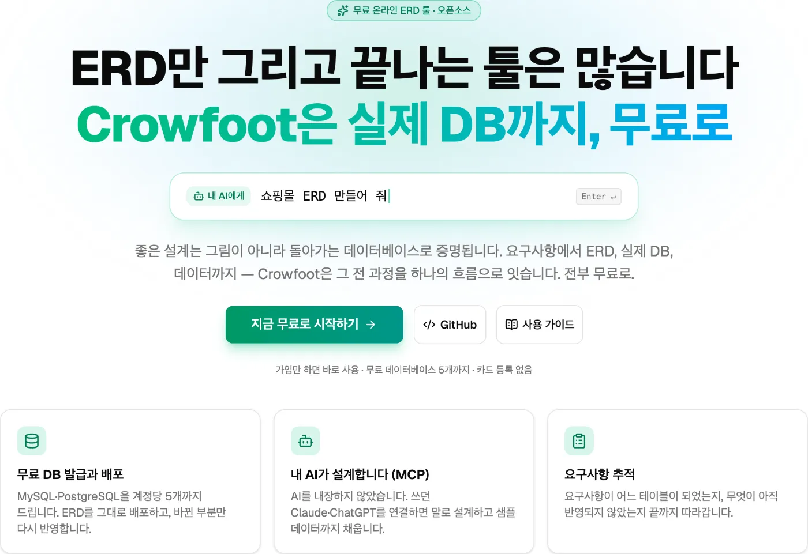
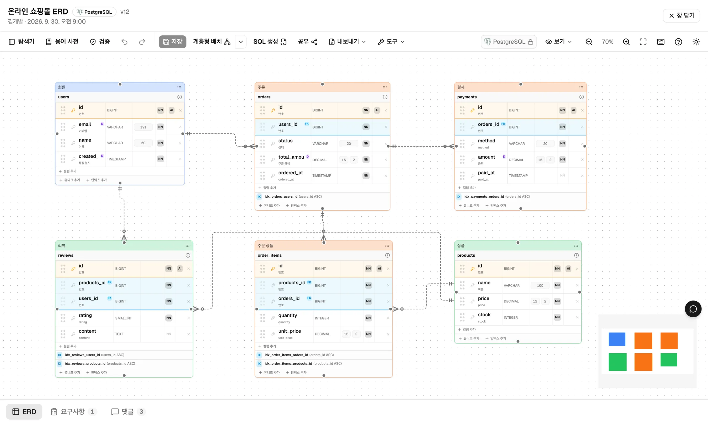
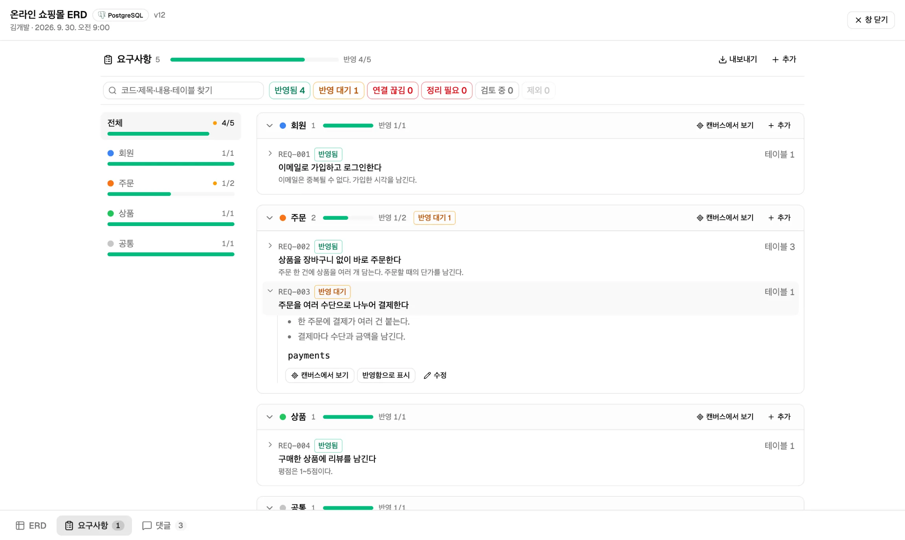
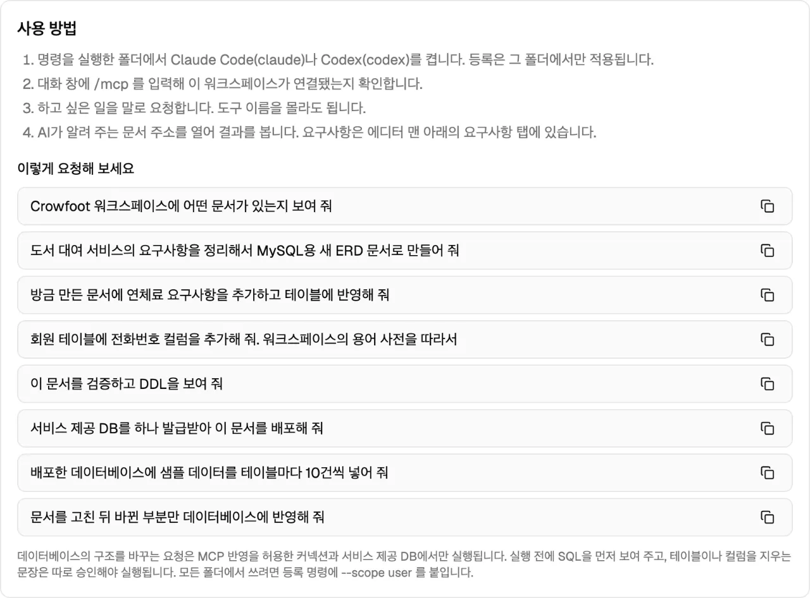
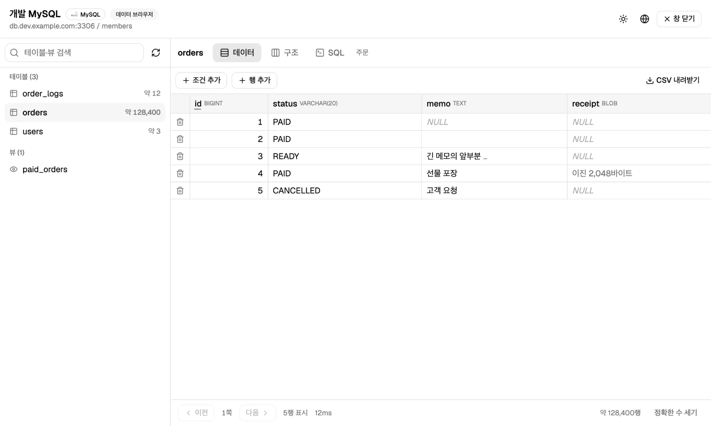
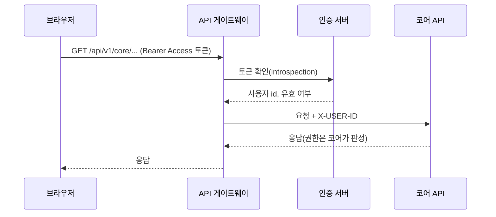
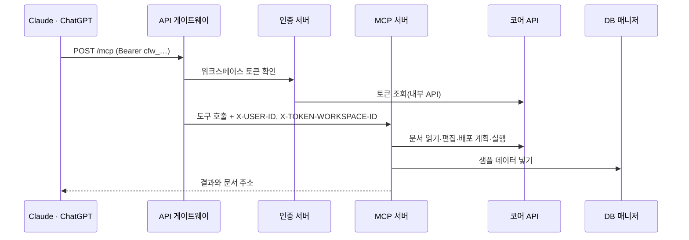
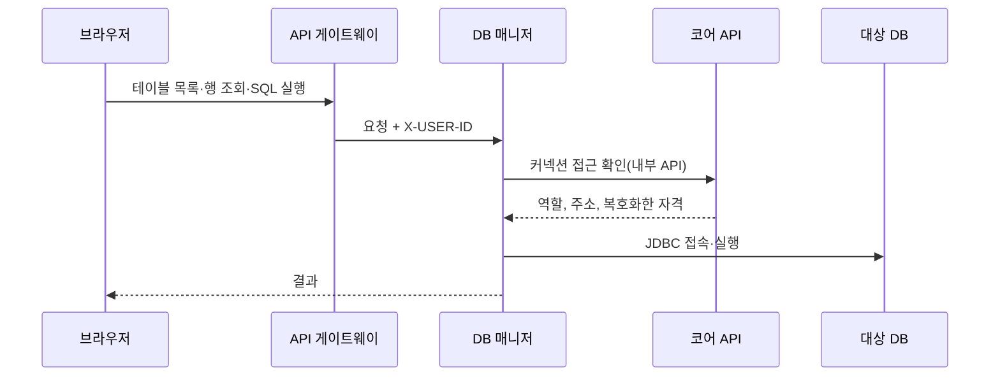

<div align="center">

🌐 **한국어** | **[English](./README.en.md)** | **[日本語](./README.ja.md)** | **[简体中文](./README.zh.md)**


# Crowfoot

**ERD만 그리고 끝나는 툴은 많습니다. Crowfoot은 실제 데이터베이스까지 갑니다.**

요구사항 → ERD → 실제 데이터베이스 → 데이터까지, 브라우저 하나로 잇는 오픈소스 ERD 플랫폼

[](https://www.apache.org/licenses/LICENSE-2.0)
[](https://crowfoot.java21.net/release-notes/38)
[](https://crowfoot.java21.net)
[](https://crowfoot.java21.net/guide#20.1)

[바로 써 보기](https://crowfoot.java21.net) · [사용 가이드](https://crowfoot.java21.net/guide) · [릴리스 노트](https://crowfoot.java21.net/release-notes) · [공유 ERD 둘러보기](https://crowfoot.java21.net/shared)

</div>

<p align="center">
  
</p>

이름은 테이블 사이의 관계를 까마귀발 모양의 기호로 그리는 **까마귀발(Crow's Foot) 표기법**에서 따왔습니다.

## 목차

- [왜 Crowfoot인가](#왜-crowfoot인가)
- [빠르게 시작하기](#빠르게-시작하기)
- [주요 기능](#주요-기능)
- [아키텍처](#아키텍처)
- [저장소](#저장소)
- [직접 실행하기](#직접-실행하기)
- [기술 스택](#기술-스택)
- [릴리스](#릴리스)
- [기여하기](#기여하기)
- [라이선스](#라이선스)

## 왜 Crowfoot인가

| | 일반적인 ERD 툴 | Crowfoot |
| --- | --- | --- |
| 결과물 | 그림, DDL 파일 | 그림·DDL에 더해 **실제로 돌아가는 데이터베이스** |
| 데이터베이스 | 직접 준비 | MySQL·PostgreSQL 개발용 DB를 **무료로 발급**(워크스페이스마다 사용자당 5개) |
| 변경 반영 | DDL을 손으로 실행 | 문서와 DB의 차이를 계산해 **마이그레이션 SQL을 만들고 실행**. 삭제 문장은 따로 승인 |
| AI | 없음, 또는 툴에 묶인 AI | **내가 쓰는 Claude·ChatGPT를 MCP로 연결**. Crowfoot에는 AI가 들어 있지 않습니다 |
| 요구사항 | 별도 문서 | 요구사항을 ERD와 함께 저장하고 **어느 테이블이 구현하는지 추적** |
| 데이터 | 다른 도구로 확인 | **데이터 브라우저**에서 조회·편집·SQL 실행, 샘플 데이터 넣기 |
| 협업 | 파일 공유 | **실시간 동시 편집**, 댓글, 버전 기록, 공유 링크 |

## 빠르게 시작하기

### 서비스로 바로 쓰기

1. https://crowfoot.java21.net 에서 GitHub나 Google 계정으로 로그인합니다.
2. 워크스페이스를 만들고 ERD 문서를 엽니다. 빈 문서에서 시작하거나, SQL 스크립트를 가져오거나, 기존 데이터베이스를 읽어 ERD로 만들 수 있습니다.
3. **데이터베이스** 탭에서 무료 MySQL·PostgreSQL을 발급받아 문서를 배포합니다.

### Claude·ChatGPT에 연결하기 (MCP)

워크스페이스의 **MCP** 탭에서 토큰을 발급하면, 토큰이 채워진 등록 명령이 나옵니다.

```bash
claude mcp add --transport http crowfoot https://crowfoot-mcp.java21.net/mcp \
  --header "Authorization: Bearer <발급한 토큰>"
```

그다음 대화로 일을 맡깁니다.

```text
> 도서 대여 서비스의 요구사항을 정리해서 ERD로 만들어 줘
> 무료 MySQL을 발급받아 배포해 줘
> 테이블마다 샘플 데이터 10건씩 넣어 줘
```

AI가 만든 결과는 Crowfoot 화면에 그대로 나타나고, 화면에서 고친 내용은 AI가 다시 읽습니다. 자세한 방법은 [사용 가이드 20절](https://crowfoot.java21.net/guide#20.1)에 있습니다.

## 주요 기능

<table>
<tr>
<td width="50%"><br/><b>ERD 에디터</b> — 까마귀발 표기, 자동 배치, 그룹, 메모</td>
<td width="50%"><br/><b>요구사항 추적</b> — 도메인별 진행, 근거 없는 테이블</td>
</tr>
<tr>
<td width="50%"><br/><b>AI 연동(MCP)</b> — 연결 명령과 요청 예시</td>
<td width="50%"><br/><b>데이터 브라우저</b> — 조회, 행 편집, SQL 콘솔</td>
</tr>
</table>

### 설계

- **브라우저 ERD 에디터** — 설치 없이 바로 씁니다. 테이블·컬럼·키·인덱스·관계를 까마귀발 표기로 그리고, 큰 문서도 자동 배치(계층형·허브 중심·하이브리드)로 정리합니다.
- **논리 모델과 물리 모델** — 논리명과 물리명을 함께 관리하고, 공용 타입을 DBMS별 타입으로 바꿉니다. 대상 DBMS는 MySQL·PostgreSQL·Oracle·SQL Server입니다.
- **표준 사전** — 단어·용어 사전과 도메인 타입으로 이름과 타입을 맞춥니다. 논리명에서 물리명을 제안하고, 도메인 타입을 바꾸면 쓰는 컬럼에 함께 반영합니다.
- **설계 검증** — 이름 중복, FK 타입 불일치, 기본 키 없음 같은 규칙 17종을 상시 검사합니다.
- **요구사항** — 요구사항을 문서에 함께 저장하고 테이블에 연결합니다. 내용이 바뀌면 "반영 대기"로 표시하고, 도메인별 진행률·수용 기준·Markdown/CSV 내보내기를 제공합니다.

### 데이터베이스

- **무료 매니지드 데이터베이스** — MySQL·PostgreSQL 개발용 DB를 버튼 하나로 발급합니다. 발급마다 그 스키마에만 권한이 있는 전용 계정을 만들고, 인스턴스 관리자 계정은 어디에도 내주지 않습니다.
- **SQL 생성과 배포** — 문서를 DBMS별 DDL로 만들고, 연결한 DB에 바로 배포합니다.
- **역설계** — 기존 DB를 읽거나 SQL 스크립트를 가져와 ERD 문서로 만듭니다.
- **마이그레이션** — 문서와 DB의 차이를 다시 계산해 변경 SQL을 만들고 실행합니다. 테이블·컬럼을 지우는 문장은 기본으로 실행하지 않습니다.
- **데이터 브라우저** — 연결한 DB의 데이터를 조회·필터·정렬하고, 행을 편집하고, SQL을 실행합니다.

### 협업과 공유

- **실시간 협업** — 여럿이 같은 문서를 동시에 편집합니다. 접속자, 커서, 선택이 실시간으로 보입니다.
- **워크스페이스와 팀** — 소유자·편집자·댓글 작성자·뷰어 권한으로 사용자와 팀을 초대합니다.
- **버전 기록** — 저장할 때마다 버전이 남고, 두 버전을 비교하거나 되돌립니다.
- **공유** — 링크로 읽기 전용 공유하고, 좋아요·댓글을 받습니다. 공유된 문서는 [공유 ERD 목록](https://crowfoot.java21.net/shared)에서 누구나 찾아볼 수 있습니다.
- **ERD 라이브러리** — 실무 주제 500여 종의 예제 ERD를 요구사항·설계 해설과 함께 공개합니다.

### 그 밖에

- **4개 언어** — 한국어·영어·일본어·중국어 화면과 사용 가이드
- **AI 연동(MCP)** — 도구 20종: 문서 읽기·만들기, 요구사항·스키마 반영, DB 발급·배포·마이그레이션, 샘플 데이터. 발급·배포·반영은 계획을 먼저 보여 주고 승인한 것만 실행합니다.
- **관리자 콘솔** — 사용자, 코드 테이블, 매니지드 DB 인스턴스, 발급 한도, 감사 로그, 트래픽 통계

## 아키텍처

Crowfoot은 서비스 7개로 이루어진 마이크로서비스입니다. 밖에서 들어오는 HTTP 요청은 모두 API 게이트웨이를 지나고, 서비스끼리는 클러스터 안의 내부 호출로만 이어집니다.


### 서비스

| 서비스 | 하는 일 | 저장소 | 의존 |
| --- | --- | --- | --- |
| **crowfoot-web** | React SPA. 에디터, 대시보드, 관리자 콘솔, 공개 페이지 | — | gateway, collab |
| **crowfoot-api-gateway** | 모든 HTTP 요청의 입구. 경로·호스트로 라우팅, 토큰 확인, 공개 경로 허용 목록, 사용자 식별 헤더(`X-USER-ID` 등) 주입 | — | auth |
| **crowfoot-auth** | GitHub·Google OAuth2 로그인(PKCE), JWT 발급·갱신, 토큰 확인(introspection), 로그아웃 블랙리스트 | Redis | core(회원·워크스페이스 토큰) |
| **crowfoot-core-api** | 도메인의 중심. 회원·워크스페이스·팀·문서·요구사항·댓글, SQL 생성·배포·역설계·마이그레이션, 매니지드 DB 발급, 감사 로그 | PostgreSQL | 매니지드 DB 인스턴스, 사용자 DB |
| **crowfoot-collab** | 실시간 협업. WebSocket(STOMP) 방에서 접속 현황과 편집 변경을 중계 | 메모리 | auth, core |
| **crowfoot-database-manager** | 데이터 브라우저. 조회·행 편집·SQL 콘솔·샘플 데이터. 자체 DB 없이 요청마다 접속 | — | core(권한·접속 정보) |
| **crowfoot-mcp** | MCP 서버. Claude·ChatGPT의 도구 호출을 core·DB 매니저 호출로 옮김 | — | core, database-manager |

### 요청 흐름

**로그인과 API 호출** — Access 토큰은 브라우저 메모리에만 두고, Refresh 토큰은 `SameSite=Strict` 쿠키로 둡니다. 게이트웨이는 요청마다 인증 서버에 토큰을 확인합니다.



**AI 연동(MCP)** — 워크스페이스 토큰(`cfw_…`)은 발급한 사람의 권한으로, 그 워크스페이스 안에서만 쓸 수 있습니다. 토큰으로는 MCP 경로만 지날 수 있고 일반 API는 막힙니다.



**데이터 브라우저** — DB 매니저는 접속 정보를 저장하지 않습니다. 요청마다 코어 API에 권한과 접속 정보를 받아 대상 DB에 접속합니다.



**실시간 협업** — 브라우저는 협업 서버에 WebSocket으로 직접 붙습니다. 협업 서버는 접속할 때 토큰과 문서 권한을 확인하고, 방 안의 변경을 순서대로 중계합니다. 문서 저장은 코어 API의 HTTP 저장으로 하고, 동시 저장은 버전 비교로 막습니다.

### 보안과 데이터 보호

- **비밀번호 암호화** — 커넥션 비밀번호와 발급 계정 비밀번호는 AES-256-GCM으로 암호화해 저장합니다.
- **권한 판정은 코어에서** — 다른 서비스는 권한을 스스로 판단하지 않고 코어 API에 묻습니다. 다른 사람의 리소스는 404로 존재 자체를 감춥니다.
- **발급 계정 격리** — 매니지드 DB는 발급마다 그 스키마에만 권한이 있는 계정을 만들고, 철회하면 스키마와 계정을 함께 지웁니다.
- **내부 주소 접속** — 운영 환경의 서버는 매니지드 DB에 클러스터 안의 내부 주소로 접속합니다. 사용자에게는 외부에서 쓸 수 있는 주소를 보여 줍니다.
- **감사 로그** — 발급·철회·배포·마이그레이션·접속 정보 조회 같은 중요한 작업을 기록합니다.

### 배포

GitOps로 배포합니다. 서비스 저장소의 `main`에 올리면 GitHub Actions가 테스트하고 이미지를 만들어 GHCR에 올린 뒤, 배포 저장소의 이미지 태그를 고칩니다. Argo CD가 그 변경을 쿠버네티스 클러스터에 반영합니다. 운영 서버는 모두 8080 포트로 뜨고, 시크릿은 환경변수로만 넣습니다.

## 저장소

| 저장소 | 설명 |
| --- | --- |
| [crowfoot-web](https://github.com/crowfoot-erd/crowfoot-web) | 프론트엔드 — React SPA. ERD 에디터(React Flow), 대시보드·워크스페이스·팀, 관리자 콘솔, 협업 클라이언트(STOMP), 4개 언어·다크 모드, 사용 가이드 |
| [crowfoot-api-gateway](https://github.com/crowfoot-erd/crowfoot-api-gateway) | API 게이트웨이 — Spring Cloud Gateway. 라우팅, 토큰 확인, 사용자 식별 헤더, 공개 경로 허용 목록 |
| [crowfoot-auth](https://github.com/crowfoot-erd/crowfoot-auth) | 인증 서버 — OAuth2 로그인(GitHub·Google·PKCE), JWT 발급·갱신·확인, 워크스페이스 토큰 확인, Redis 블랙리스트 |
| [crowfoot-core-api](https://github.com/crowfoot-erd/crowfoot-core-api) | 코어 API — 회원·워크스페이스·팀·문서·요구사항·댓글, 매니지드 DB 발급·철회, SQL 생성·배포·역설계·마이그레이션, 문서 편집 API, 코드 테이블·감사 로그 |
| [crowfoot-collab](https://github.com/crowfoot-erd/crowfoot-collab) | 협업 서버 — WebSocket(STOMP). 문서별 접속 현황과 편집 변경의 실시간 중계 |
| [crowfoot-database-manager](https://github.com/crowfoot-erd/crowfoot-database-manager) | DB 매니저 — 데이터 조회·행 편집·SQL 콘솔·샘플 데이터. 자체 DB 없이 요청마다 접속하고 권한은 코어 API에 묻습니다 |
| [crowfoot-mcp](https://github.com/crowfoot-erd/crowfoot-mcp) | MCP 서버 — Spring AI MCP. 요구사항·ERD 읽기와 쓰기, DB 발급·배포·마이그레이션, 샘플 데이터를 도구로 제공 |

## 직접 실행하기

### 준비물

| 도구 | 버전 | 쓰는 곳 |
| --- | --- | --- |
| Java (Temurin) | 21 | 서버 6종 |
| Maven | 3.9 이상 | 서버 빌드·실행 |
| Node.js / pnpm | 20.19 이상 / 10 | 프론트엔드 |
| PostgreSQL | 16 이상 | 서비스 DB (`crowfoot` 데이터베이스, `crowfoot_core` 스키마) |
| Redis | 6 이상 | 로그아웃 블랙리스트 |

스키마는 자동으로 만들지 않습니다(`ddl-auto: none`). DDL 스크립트로 먼저 초기화합니다.

### 로컬 포트

| 서비스 | 포트 | 비고 |
| --- | --- | --- |
| crowfoot-web (Vite) | 8080 | `/api` 요청을 게이트웨이(8000)로 넘깁니다 |
| crowfoot-api-gateway | 8000 | auth·core·database-manager로, MCP 호스트의 `/mcp`는 MCP 서버로 라우팅 |
| crowfoot-auth | 8081 | |
| crowfoot-core-api | 8082 | |
| crowfoot-collab | 8083 | WebSocket — 게이트웨이를 거치지 않고 직접 붙습니다 |
| crowfoot-database-manager | 8084 | |
| crowfoot-mcp | 8085 | |

### 환경변수

각 서버는 저장소 루트의 `.env-local`(git에 올라가지 않음)을 읽습니다. `.env-local.example`을 복사해 값을 채웁니다. 게이트웨이·collab·DB 매니저·MCP 서버는 따로 필요한 값이 없습니다.

**crowfoot-auth**

| 변수 | 설명 |
| --- | --- |
| `CROWFOOT_AUTH_JWT_SECRET` | JWT HS256 서명 키 — Base64 32바이트 이상 (`openssl rand -base64 48`) |
| `CROWFOOT_AUTH_FLOW_SECRET` | 로그인 흐름 쿠키(`auth_flow`)의 HMAC-SHA256 서명 키 — JWT 키와 따로 둡니다 |
| `CROWFOOT_AUTH_GITHUB_CLIENT_ID` / `..._SECRET` | GitHub OAuth 앱 자격 |
| `CROWFOOT_AUTH_GOOGLE_CLIENT_ID` / `..._SECRET` | Google OAuth 클라이언트 자격 (PKCE) |
| `CROWFOOT_REDIS_PASSWORD` / `CROWFOOT_REDIS_DATABASE` | Redis 접속 (호스트는 `application-local.yml`) |

OAuth 앱에는 리디렉션 URI로 `http://localhost:8080/auth/callback`을 등록합니다.

**crowfoot-core-api**

| 변수 | 설명 |
| --- | --- |
| `DB_URL` | PostgreSQL JDBC URL — `jdbc:postgresql://{host}:5432/crowfoot?currentSchema=crowfoot_core` |
| `DB_USERNAME` / `DB_PASSWORD` | 서비스 DB 계정 |
| `CROWFOOT_CONNECTION_SECRET_KEY` | 커넥션 비밀번호 암호화 키 — Base64 32바이트. 로컬은 개발용 기본값이 있고, 운영은 반드시 지정합니다 |

**crowfoot-web** — 개발은 기본값 그대로 씁니다(`VITE_API_BASE_URL`을 비워 Vite 프록시로 같은 출처를 유지). 운영 빌드에는 `VITE_API_BASE_URL`(게이트웨이 주소), `VITE_WS_URL`(협업 서버 주소, `wss://`), `VITE_MCP_URL`(MCP 주소)을 넣습니다.

### 실행

```bash
# 서버 6종 — 각 저장소에서 (로컬 프로필이 기본)
mvn spring-boot:run

# 프론트엔드
pnpm install
pnpm dev        # http://localhost:8080
```

권장 순서는 auth → core-api → gateway → collab · database-manager · mcp → web입니다. 게이트웨이는 auth가 떠 있어야 토큰을 확인할 수 있습니다.

## 기술 스택

### 공통 기반

| 기술 | 버전 | 쓰는 곳 | 왜·무엇을 |
| --- | --- | --- | --- |
| Java | 21 | 서버 6종 | LTS 버전. 레코드, 패턴 매칭, 가상 스레드를 쓸 수 있는 현재 기준 |
| Spring Boot | 4.1 | 서버 6종 | 서버마다 같은 버전으로 맞춰 설정·로깅·헬스 체크(Actuator) 방식을 통일합니다. 쿠버네티스는 Actuator 헬스 체크로 서버 상태를 확인합니다 |
| Spring Cloud | 2025.1 | gateway, auth, database-manager | 게이트웨이와 서비스 간 호출(OpenFeign, LoadBalancer)의 버전을 한 묶음으로 관리합니다 |
| Lombok | — | 서버 | 생성자·접근자 같은 반복 코드를 줄입니다 |

### 서버별

| 서버 | 핵심 기술 | 쓰는 이유와 역할 |
| --- | --- | --- |
| **crowfoot-api-gateway** | Spring Cloud Gateway (WebFlux) | 모든 HTTP 요청의 입구입니다. 논블로킹(리액티브) 방식이라 적은 스레드로 많은 요청을 중계합니다. 경로와 호스트로 라우팅하고(`/api/v1/core/**` → core, MCP 호스트의 `/mcp` → MCP 서버), 전역 필터에서 토큰을 인증 서버에 확인한 뒤 사용자 식별 헤더(`X-USER-ID` 등)를 붙입니다. 로그인 없이 열리는 공개 경로는 허용 목록으로 관리합니다 |
| **crowfoot-auth** | Spring Security · OAuth2 Client · spring-security-oauth2-jose · Spring Data Redis · OpenFeign | GitHub·Google 로그인(OAuth2, Google은 PKCE)을 처리합니다. Access 토큰은 JWT(HS256)로 발급·검증하고, Refresh 토큰은 쿠키로 둡니다. 로그아웃한 토큰은 Redis 블랙리스트에 만료 시간까지만 보관합니다. 회원 정보와 워크스페이스 토큰은 OpenFeign으로 core에 묻습니다 |
| **crowfoot-core-api** | Spring Web MVC · Spring Data JPA (Hibernate 7) · Querydsl 5.1 · Bean Validation · PostgreSQL/MySQL JDBC · Commons DBCP2 · MaxMind GeoIP2 | 도메인의 중심입니다. JPA로 회원·워크스페이스·문서를 저장하고, 목록·검색 같은 동적 조건은 Querydsl로 타입 안전하게 씁니다(연관 조회는 fetch join으로 N+1을 막습니다). JDBC 드라이버로 사용자의 데이터베이스를 읽어 ERD로 만들고(역설계), DDL을 배포하고, 무료 데이터베이스를 발급합니다. GeoIP2는 관리자 트래픽 통계의 국가 집계에 씁니다 |
| **crowfoot-collab** | Spring WebSocket · STOMP · RestClient | 실시간 협업 서버입니다. 문서마다 STOMP 방을 두고 접속자, 커서, 편집 변경을 순서대로 중계합니다. 접속할 때 RestClient로 auth에 토큰을, core에 문서 권한을 확인합니다 |
| **crowfoot-database-manager** | Spring Web MVC · JDBC (PostgreSQL·MySQL 드라이버) · OpenFeign | 데이터 브라우저입니다. 자체 DB 없이 요청마다 대상 DB에 JDBC로 접속하고 끝나면 닫습니다. 접속 정보와 권한은 OpenFeign으로 core에 묻습니다. 행 편집과 샘플 데이터는 한 트랜잭션으로 넣습니다 |
| **crowfoot-mcp** | Spring AI 2.0 (MCP Server, WebMVC) · RestClient | Claude·ChatGPT 같은 MCP 클라이언트의 진입점입니다. Spring AI의 MCP 서버(HTTP 전송)로 도구 20종을 공개하고, 도구 호출을 core·database-manager의 내부 API 호출로 옮깁니다. 서버 안내문(instructions)으로 AI가 지킬 작업 순서와 규칙을 알려 줍니다 |

### 프론트엔드 (crowfoot-web)

| 기술 | 버전 | 쓰는 곳과 이유 |
| --- | --- | --- |
| React | 19 | 화면 전체. 컴포넌트 단위로 에디터, 대시보드, 관리자 화면을 만듭니다 |
| TypeScript | 6 | 문서 구조, API 응답 타입을 코드에서 검사합니다 |
| Vite | 8 | 개발 서버와 빌드. 빌드 때 사이트맵 생성, 공개 페이지 프리렌더(검색 노출)도 함께 돕니다 |
| React Router | 7 | 화면 이동과 언어별 주소(`/en`, `/ja`, `/zh`) |
| TanStack Query | 5 | 서버 데이터 조회·캐시·재요청. 목록과 상세 화면의 로딩·오류 상태를 일관되게 다룹니다 |
| Zustand | 5 | 에디터 문서 상태, 되돌리기·다시 실행, 패널 열림 같은 화면 상태 |
| React Flow (@xyflow/react) | 12 | ERD 캔버스. 테이블 노드와 관계선을 그리고, 확대·이동·선택을 처리합니다. 관계선 경로와 까마귀발 표기는 직접 구현했습니다 |
| elkjs | 0.12 | 자동 배치(계층형). 테이블 위치만 계산하고 관계선은 자체 라우터가 다시 그립니다 |
| Zod | 4 | 문서 본체(JSON) 스키마 검증. 예전 문서도 안전하게 읽습니다 |
| Tailwind CSS · shadcn/ui (Radix UI) | 4 · — | 스타일과 기본 컴포넌트(대화상자, 메뉴, 탭). 다크 모드와 테마 색을 토큰으로 관리합니다 |
| i18next · react-i18next | 26 · 17 | 4개 언어(한국어·영어·일본어·중국어) 화면 문구 |
| CodeMirror | 6 | SQL 콘솔. 문법 강조와 키워드·테이블 이름 자동 완성 |
| Toast UI Editor | 3 | 커뮤니티 게시글, 릴리스 노트, 사용 가이드의 마크다운 작성·표시 |
| STOMP.js | 7 | 실시간 협업 클라이언트 |
| Recharts | 3 | 관리자 트래픽 통계 차트 |
| html-to-image | 1 | ERD를 PNG 이미지로 내보내기 |

### 데이터와 인프라

| 기술 | 쓰는 곳 | 역할 |
| --- | --- | --- |
| PostgreSQL 16 | core | 서비스 DB(회원·워크스페이스·문서·감사 로그, `crowfoot_core` 스키마). 무료 PostgreSQL 발급용 인스턴스이기도 합니다 |
| MySQL 8 | core, database-manager | 무료 MySQL 발급용 인스턴스 |
| Redis 6 | auth | 로그아웃한 Access 토큰 블랙리스트(만료 시간 TTL, AOF로 보관) |
| Docker · GHCR | 서버 6종, web | 저장소마다 이미지를 만들어 GitHub Container Registry에 올립니다 |
| GitHub Actions | 저장소 7개 | main에 올리면 테스트하고 이미지를 만든 뒤 배포 저장소의 이미지 태그를 고칩니다 |
| Kubernetes · Argo CD | 운영 | Argo CD가 배포 저장소(`apps/*`)를 지켜보다 클러스터에 반영합니다(GitOps). 서버는 순차 교체로 무중단 배포합니다 |
| nginx | 앞단, web | 앞단에서 TLS를 끝내고 호스트별로 넘깁니다. web 컨테이너 안에서는 정적 파일과 프리렌더 페이지를 내줍니다 |

### 테스트

| 기술 | 쓰는 곳 | 역할 |
| --- | --- | --- |
| JUnit 5 · Spring Boot Test | 서버 6종 | 단위·통합 테스트 |
| Testcontainers | core, database-manager | 실제 PostgreSQL·MySQL 컨테이너로 SQL 생성, 역설계, 데이터 편집을 검증합니다 |
| MockWebServer · embedded-redis | gateway, auth, collab | 다른 서비스와 Redis를 흉내 내어 서비스 간 호출을 검증합니다 |
| Vitest · Testing Library | web | 화면과 로직 테스트(1,300여 건) |
| MSW | web | 가짜 API 서버. 테스트와 사용 가이드 그림 촬영에 씁니다 |
| Playwright | web | 실제 브라우저 확인과 사용 가이드·릴리스 노트 그림 촬영 |

## 릴리스

버전마다 [릴리스 노트](https://crowfoot.java21.net/release-notes)를 4개 언어로 공개합니다. 각 버전은 서비스 저장소 7개 전부에 같은 git 태그(`vX.Y`)로 남깁니다 — 변경이 없던 저장소에도 시스템 버전을 맞추는 태그를 찍습니다.

| 버전 | 날짜 | 주요 내용 | 릴리스 노트 |
| --- | --- | --- | --- |
| v1.34 | 2026-10-06 | 배포 SQL 수정(문자열 기본값 따옴표·VARBINARY 길이), CHECK 제약·생성 컬럼·전문 검색 인덱스, 검증 경고의 의도된 예외, 제안 및 신고 알림, MCP 버그 신고 | [보기](https://crowfoot.java21.net/release-notes/38) |
| v1.33 | 2026-10-03 | 사이트 디자인 통일(기본색·메뉴·제목), 사용 가이드 다듬기(같은 배율의 그림·설명 보강·4개 언어 교정), 릴리스 노트 33건 다듬기, 로컬에서도 무료 DB 발급·철회 | [보기](https://crowfoot.java21.net/release-notes/35) |
| v1.32 | 2026-10-03 | AI 연동 확장(샘플 데이터 넣기, 문서 주소 안내, 삭제 문장 기본 제외), 요구사항 도메인별 정리(진행·찾기·내보내기·수용 기준), 공유 문서 목록·릴리스 노트 목차 화면, 새 첫 화면, 새 버전 안내 | [보기](https://crowfoot.java21.net/release-notes/34) |
| v1.31 | 2026-10-02 | Claude 연동(MCP — 워크스페이스 토큰으로 Claude Code 연결, 대화로 요구사항·ERD 작성), 요구사항 패널(테이블 연결·반영 대기 표시), 열 때 자동 배치, 커넥션별 MCP 반영 허용 | [보기](https://crowfoot.java21.net/release-notes/33) |
| v1.30 | 2026-10-02 | 용어와 도메인 타입 연결, 컬럼 이름 제안을 용어·단어로 구분, 표준 패널 통합, 사용 가이드(4개 언어 화면·찾기) | [보기](https://crowfoot.java21.net/release-notes/32) |

<details>
<summary>이전 버전 (v1.08 ~ v1.29)</summary>

| 버전 | 날짜 | 주요 내용 | 릴리스 노트 |
| --- | --- | --- | --- |
| v1.29 | 2026-10-02 | 도메인 타입(공용 타입 정의·변경 전파 미리보기), 다른 문서로 붙여넣기, 관계의 컬럼 매핑 편집, 자동 배치 방향 | [보기](https://crowfoot.java21.net/release-notes/31) |
| v1.28 | 2026-10-01 | 데이터 브라우저(조회·필터·정렬·CSV), 행 편집(모아서 적용·충돌 감지), SQL 콘솔(문법 강조·자동 완성) | [보기](https://crowfoot.java21.net/release-notes/30) |
| v1.27 | 2026-10-01 | 다른 DBMS로 복제, 에디터 도구 모음 정리, 문서 목록 작업 메뉴, 랜딩·로그인 화면 개편 | [보기](https://crowfoot.java21.net/release-notes/29) |
| v1.26 | 2026-09-30 | 문서-데이터베이스 연결, 마이그레이션 DDL DB 반영(실행 시점 재계산·문장별 리포트) | [보기](https://crowfoot.java21.net/release-notes/28) |
| v1.25 | 2026-09-29 | ERD 라이브러리 공개(실무 주제 509종), 배치 간격 밸런스 | [보기](https://crowfoot.java21.net/release-notes/27) |
| v1.24 | 2026-09-29 | 자동 배치 3모드, 드래그 중 관계선 실시간 재경로, 1:1 관계 유니크 키 자동 생성, 문서 목록 페이징 | [보기](https://crowfoot.java21.net/release-notes/26) |
| v1.23 | 2026-09-28 | 릴리스 노트 이미지 개선, 배포 절차 문서화 — 기능 변화 없음 | [보기](https://crowfoot.java21.net/release-notes/25) |
| v1.22 | 2026-09-28 | 알림(헤더 벨·알림 3종·전체 알림 페이지) | [보기](https://crowfoot.java21.net/release-notes/24) |
| v1.21 | 2026-09-28 | 문서 단위 피드백(좋아요·익명 댓글·작성자 답글), 공개 뷰어 SQL 내보내기 | [보기](https://crowfoot.java21.net/release-notes/23) |
| v1.20 | 2026-09-27 | 설계 검증(규칙 17종), FK 인덱스 자동 생성 | [보기](https://crowfoot.java21.net/release-notes/22) |
| v1.19 | 2026-09-27 | 관리자 트래픽 통계 | [보기](https://crowfoot.java21.net/release-notes/21) |
| v1.18 | 2026-09-27 | 템플릿 쇼케이스, 통합 공유 갤러리, 공유 문서 SEO, 빈 캔버스 안내 | [보기](https://crowfoot.java21.net/release-notes/20) |
| v1.17 | 2026-09-26 | 실시간 협업 고도화(커서·선택·이동, 동시 편집 수렴, 편집 잠금) | [보기](https://crowfoot.java21.net/release-notes/19) |
| v1.16 | 2026-09-25 | 4개 언어 전면 지원, 언어별 URL·SEO | [보기](https://crowfoot.java21.net/release-notes/18) |
| v1.15 | 2026-09-25 | 시스템 사전 확장(표준 토큰 34,075개) | [보기](https://crowfoot.java21.net/release-notes/17) |
| v1.14 | 2026-09-25 | 용어 사전 패널, 컬럼 물리명 사전 제안 | [보기](https://crowfoot.java21.net/release-notes/16) |
| v1.13 | 2026-09-24 | 논리 그룹(주제 영역), 논리명 자동 추론, 단축키 안내 | [보기](https://crowfoot.java21.net/release-notes/15) |
| v1.12 | 2026-09-23 | 모델 익스플로러·통합 검색, SQL 가져오기 | [보기](https://crowfoot.java21.net/release-notes/14) |
| v1.11 | 2026-09-22 | 관계 편집·버전 비교 개선, 빠른 이미지 내보내기 | [보기](https://crowfoot.java21.net/release-notes/13) |
| v1.10 | 2026-09-21 | 버전 비교·마이그레이션 DDL | [보기](https://crowfoot.java21.net/release-notes/11) |
| v1.09 | 2026-09-20 | 문서 버전 기록·DB 동기화 | [보기](https://crowfoot.java21.net/release-notes/10) |
| v1.08 | 2026-09-18 | 커뮤니티 게시판·실시간 채팅·에디터 안전장치 | [보기](https://crowfoot.java21.net/release-notes/9) |

</details>

## 기여하기

버그 제보, 기능 제안, 풀 리퀘스트를 모두 환영합니다.

- **버그·제안** — 해당 저장소의 Issue에 남겨 주세요. 어느 저장소인지 모르겠다면 [crowfoot-web](https://github.com/crowfoot-erd/crowfoot-web/issues)에 남기면 됩니다. 재현 순서, 기대한 동작, 실제 동작, 화면 캡처가 있으면 빨리 고칠 수 있습니다.
- **풀 리퀘스트** — 변경 범위를 작게 나누고, 테스트를 함께 올려 주세요. 서버는 `mvn test`, 프론트엔드는 `pnpm vitest run`과 `pnpm build`가 통과해야 합니다.
- **화면이 바뀌는 변경** — 사용 가이드(4개 언어)의 설명과 그림도 함께 고쳐 주세요.
- **보안 문제** — 공개 Issue 대신 저장소 관리자에게 먼저 알려 주세요.

## 라이선스

모든 저장소는 [Apache License 2.0](https://www.apache.org/licenses/LICENSE-2.0)으로 배포됩니다.
