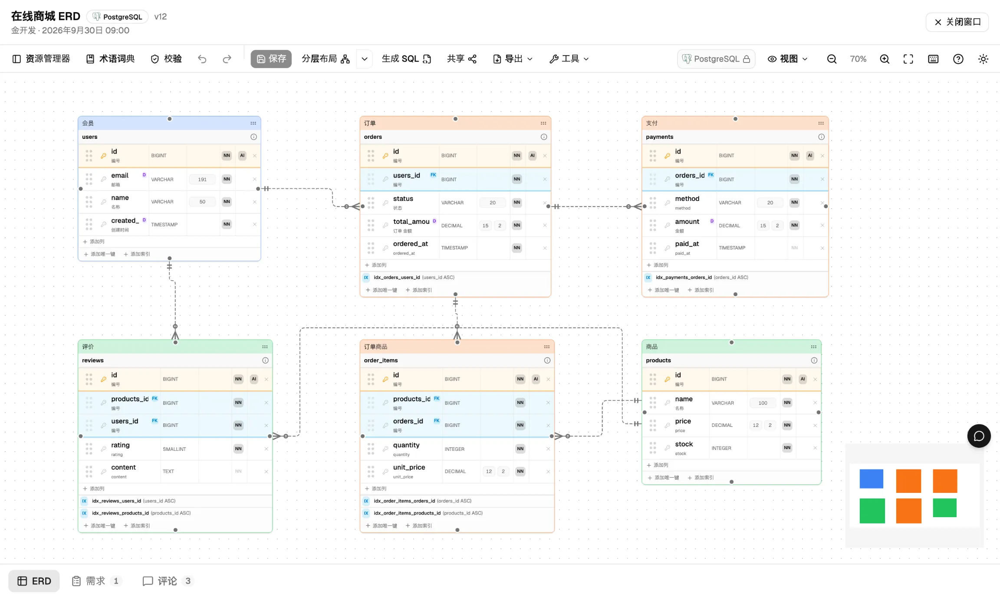
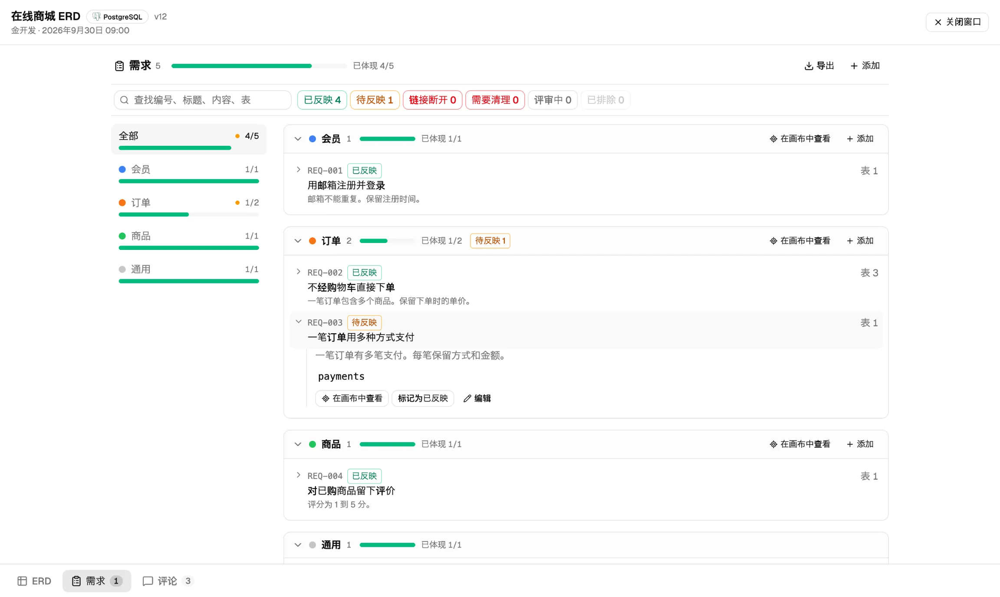
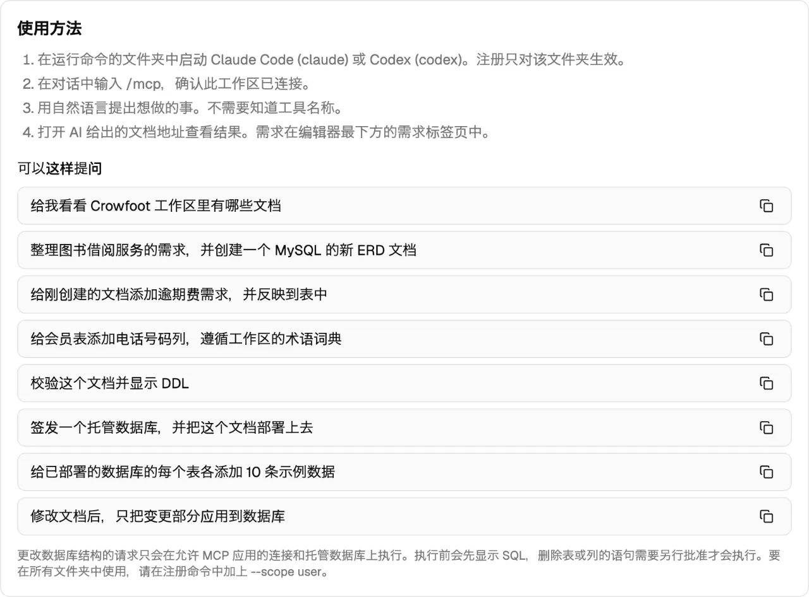
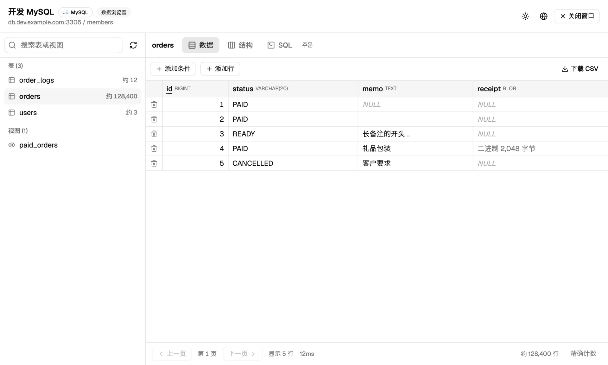
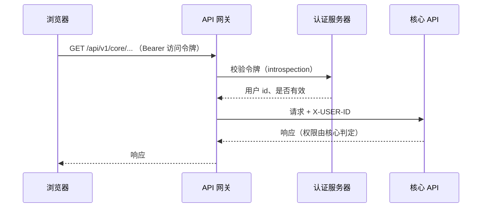
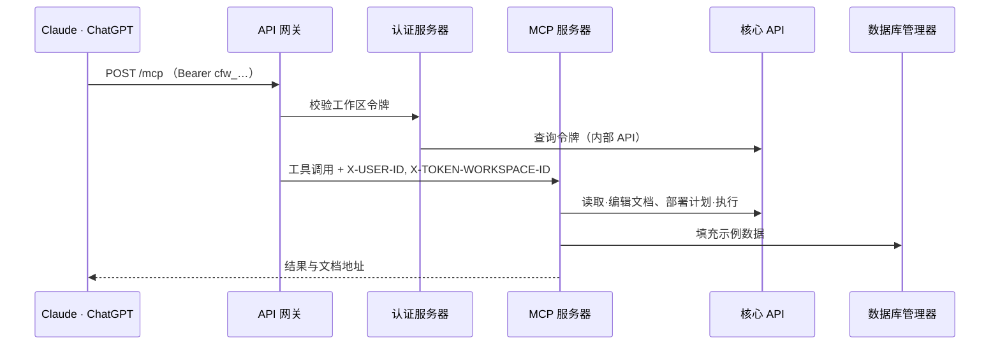
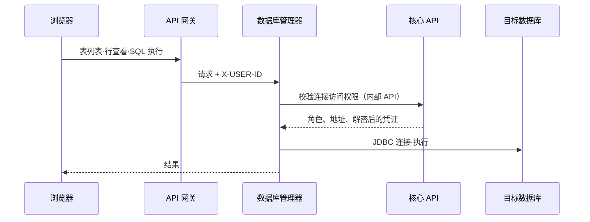

<div align="center">

🌐 **[한국어](./README.md)** | **[English](./README.en.md)** | **[日本語](./README.ja.md)** | **简体中文**


# Crowfoot

**只能画 ERD 的工具很多，Crowfoot 一路做到真实数据库。**

在一个浏览器里把需求 → ERD → 真实数据库 → 数据连成一线的开源 ERD 平台

[](https://www.apache.org/licenses/LICENSE-2.0)
[](https://crowfoot.java21.net/release-notes/49)
[](https://crowfoot.java21.net)
[](https://crowfoot.java21.net/guide#20.1)

[立即使用](https://crowfoot.java21.net) · [使用指南](https://crowfoot.java21.net/guide) · [发布说明](https://crowfoot.java21.net/release-notes) · [浏览共享 ERD](https://crowfoot.java21.net/shared)

</div>

<p align="center">
  
</p>

这个名字来源于**鸦脚（Crow's Foot）记法**，即用形似乌鸦脚印的符号来绘制表之间关系的记法。

## 目录

- [为什么选择 Crowfoot](#为什么选择-crowfoot)
- [快速开始](#快速开始)
- [主要功能](#主要功能)
- [架构](#架构)
- [仓库](#仓库)
- [自行运行](#自行运行)
- [技术栈](#技术栈)
- [版本发布](#版本发布)
- [参与贡献](#参与贡献)
- [许可证](#许可证)

## 为什么选择 Crowfoot

| | 一般的 ERD 工具 | Crowfoot |
| --- | --- | --- |
| 产出 | 图、DDL 文件 | 除了图和 DDL，还有**真正能运行的数据库** |
| 数据库 | 自行准备 | **免费签发** MySQL、PostgreSQL 开发用数据库（每个工作区每位用户 5 个） |
| 应用变更 | 手动执行 DDL | 计算文档与数据库之间的差异，**生成并执行迁移 SQL**。删除语句需单独批准 |
| AI | 没有，或绑定在工具里的 AI | **通过 MCP 连接你正在使用的 Claude、ChatGPT**。Crowfoot 本身不内置 AI |
| 需求 | 另外的文档 | 需求与 ERD 一起保存，并**追踪由哪些表来实现** |
| 数据 | 用其他工具查看 | 在**数据浏览器**中查看、编辑、执行 SQL，并填充示例数据 |
| 协作 | 共享文件 | **实时协同编辑**、评论、版本历史、共享链接 |

## 快速开始

### 直接使用在线服务

1. 在 https://crowfoot.java21.net 使用 GitHub 或 Google 账号登录。
2. 创建工作区并打开 ERD 文档。你可以从空白文档开始，也可以导入 SQL 脚本，或读取现有数据库生成 ERD。
3. 在**数据库**标签页签发免费的 MySQL、PostgreSQL，并部署文档。

### 连接 Claude、ChatGPT（MCP）

在工作区的 **MCP** 标签页签发令牌后，会显示已填好令牌的注册命令。

```bash
claude mcp add --transport http crowfoot https://crowfoot-mcp.java21.net/mcp \
  --header "Authorization: Bearer <签发的令牌>"
```

然后通过对话把工作交给 AI。

```text
> 整理图书借阅服务的需求并做成 ERD
> 签发一个免费的 MySQL 并部署
> 给每个表各添加 10 条示例数据
```

AI 生成的结果会原样显示在 Crowfoot 界面中，你在界面上修改的内容 AI 也会重新读取。详细方法请参阅[使用指南第 20 节](https://crowfoot.java21.net/guide#20.1)。

## 主要功能

<table>
<tr>
<td width="50%"><br/><b>ERD 编辑器</b> — 鸦脚记法、自动布局、分组、备注</td>
<td width="50%"><br/><b>需求追踪</b> — 按领域的进度、没有依据的表</td>
</tr>
<tr>
<td width="50%"><br/><b>AI 集成（MCP）</b> — 连接命令与请求示例</td>
<td width="50%"><br/><b>数据浏览器</b> — 查看、行编辑、SQL 控制台</td>
</tr>
</table>

### 设计

- **浏览器 ERD 编辑器** — 无需安装，打开即用。用鸦脚记法绘制表、列、键、索引和关系，大型文档也能用自动布局（分层、中心辐射、混合）整理。
- **逻辑模型与物理模型** — 同时管理逻辑名和物理名，并把通用类型转换为各 DBMS 的类型。目标 DBMS 为 MySQL、PostgreSQL、Oracle、SQL Server。
- **标准词典** — 用单词词典、术语词典和域类型统一名称与类型。根据逻辑名建议物理名，修改域类型后会同步到使用它的列。
- **设计校验** — 持续检查名称重复、外键类型不一致、缺少主键等 17 条规则。
- **需求** — 把需求一起保存在文档中并链接到表。内容变更后标记为“待反映”，并提供按领域的进度、验收标准以及 Markdown/CSV 导出。

### 数据库

- **免费托管数据库** — 一键签发 MySQL、PostgreSQL 开发用数据库。每次签发都会创建只对该 schema 拥有权限的专用账户，实例管理员账户绝不对外提供。
- **SQL 生成与部署** — 把文档生成为各 DBMS 的 DDL，并直接部署到已连接的数据库。
- **逆向工程** — 读取现有数据库或导入 SQL 脚本，生成 ERD 文档。
- **迁移** — 重新计算文档与数据库之间的差异，生成并执行变更 SQL。删除表或列的语句默认不执行。
- **数据浏览器** — 查看、筛选、排序已连接数据库中的数据，编辑行，执行 SQL。

### 协作与共享

- **实时协作** — 多人同时编辑同一文档，在线成员、光标和选区都实时可见。
- **工作区与团队** — 以所有者、编辑者、评论者、查看者权限邀请用户和团队。
- **版本历史** — 每次保存都会留下版本，可以比较两个版本或回滚。
- **共享** — 通过链接以只读方式共享，并接收点赞和评论。任何人都可以在[共享 ERD 列表](https://crowfoot.java21.net/shared)中找到已共享的文档。
- **ERD 图库** — 公开 500 多个实务主题的示例 ERD，并附有需求与设计说明。

### 其他

- **4 种语言** — 韩语、英语、日语、中文界面和使用指南
- **AI 集成（MCP）** — 26 种工具：读取和创建文档、应用和同步需求与 schema、用数据确认验收标准、数据库签发·部署·迁移、将数据库结构同步到文档、示例数据、问题报告。签发、部署和应用都会先展示计划，只执行你批准的部分。
- **管理控制台** — 用户、代码表、托管数据库实例、签发配额、审计日志、流量统计

## 架构

Crowfoot 是由 7 个服务组成的微服务架构。所有来自外部的 HTTP 请求都经过 API 网关，服务之间只通过集群内部调用相连。


### 服务

| 服务 | 职责 | 存储 | 依赖 |
| --- | --- | --- | --- |
| **crowfoot-web** | React SPA。编辑器、仪表板、管理控制台、公开页面 | — | gateway, collab |
| **crowfoot-api-gateway** | 所有 HTTP 请求的入口。按路径和主机路由、令牌校验、公开路径白名单、注入用户身份头（`X-USER-ID` 等） | — | auth |
| **crowfoot-auth** | GitHub、Google OAuth2 登录（PKCE）、JWT 签发与刷新、令牌校验（introspection）、登出黑名单 | Redis | core（会员、工作区令牌） |
| **crowfoot-core-api** | 领域的中心。会员、工作区、团队、文档、需求、评论，SQL 生成·部署·逆向工程·迁移，托管数据库签发，审计日志 | PostgreSQL | 托管数据库实例、用户数据库 |
| **crowfoot-collab** | 实时协作。在 WebSocket（STOMP）房间中中继在线状态和编辑变更 | 内存 | auth, core |
| **crowfoot-database-manager** | 数据浏览器。查看、行编辑、SQL 控制台、示例数据。自身没有数据库，每次请求时连接 | — | core（权限、连接信息） |
| **crowfoot-mcp** | MCP 服务器。把 Claude、ChatGPT 的工具调用转换为对 core 和数据库管理器的调用 | — | core, database-manager |

### 请求流程

**登录与 API 调用** — 访问令牌只保存在浏览器内存中，刷新令牌放在 `SameSite=Strict` Cookie 中。网关对每个请求都向认证服务器校验令牌。



**AI 集成（MCP）** — 工作区令牌（`cfw_…`）以签发人的权限、仅在该工作区内使用。令牌只能通过 MCP 路径，普通 API 会被拦截。



**数据浏览器** — 数据库管理器不保存连接信息。每次请求都从核心 API 获取权限和连接信息，再连接目标数据库。



**实时协作** — 浏览器通过 WebSocket 直接连接协作服务器。协作服务器在连接时校验令牌和文档权限，并按顺序中继房间内的变更。文档通过核心 API 的 HTTP 保存来存储，并发保存通过版本比较来阻止。

### 安全与数据保护

- **密码加密** — 连接密码和签发账户的密码都使用 AES-256-GCM 加密存储。
- **权限判定在核心完成** — 其他服务不自行判断权限，而是询问核心 API。他人的资源返回 404，连是否存在都不暴露。
- **签发账户隔离** — 托管数据库每次签发都会创建只对该 schema 拥有权限的账户，撤销时会同时删除 schema 和账户。
- **通过内部地址连接** — 生产环境的服务器通过集群内部地址连接托管数据库，向用户展示的则是可从外部访问的地址。
- **审计日志** — 记录签发、撤销、部署、迁移、查看连接信息等重要操作。

### 部署

采用 GitOps 部署。推送到服务仓库的 `main` 后，GitHub Actions 会运行测试、构建镜像并推送到 GHCR，然后修改部署仓库中的镜像标签。Argo CD 再把该变更应用到 Kubernetes 集群。生产服务器全部使用 8080 端口启动，密钥只通过环境变量注入。

## 仓库

| 仓库 | 说明 |
| --- | --- |
| [crowfoot-web](https://github.com/crowfoot-erd/crowfoot-web) | 前端 — React SPA。ERD 编辑器（React Flow）、仪表板·工作区·团队、管理控制台、协作客户端（STOMP）、4 种语言·深色模式、使用指南 |
| [crowfoot-api-gateway](https://github.com/crowfoot-erd/crowfoot-api-gateway) | API 网关 — Spring Cloud Gateway。路由、令牌校验、用户身份头、公开路径白名单 |
| [crowfoot-auth](https://github.com/crowfoot-erd/crowfoot-auth) | 认证服务器 — OAuth2 登录（GitHub·Google·PKCE）、JWT 签发·刷新·校验、工作区令牌校验、Redis 黑名单 |
| [crowfoot-core-api](https://github.com/crowfoot-erd/crowfoot-core-api) | 核心 API — 会员·工作区·团队·文档·需求·评论、托管数据库签发·撤销、SQL 生成·部署·逆向工程·迁移、文档编辑 API、代码表·审计日志 |
| [crowfoot-collab](https://github.com/crowfoot-erd/crowfoot-collab) | 协作服务器 — WebSocket（STOMP）。按文档实时中继在线状态和编辑变更 |
| [crowfoot-database-manager](https://github.com/crowfoot-erd/crowfoot-database-manager) | 数据库管理器 — 数据查看·行编辑·SQL 控制台·示例数据。自身没有数据库，每次请求时连接，权限交由核心 API 判定 |
| [crowfoot-mcp](https://github.com/crowfoot-erd/crowfoot-mcp) | MCP 服务器 — Spring AI MCP。以工具形式提供需求·ERD 的读写、数据库签发·部署·迁移以及示例数据 |

## 自行运行

### 前置条件

| 工具 | 版本 | 用途 |
| --- | --- | --- |
| Java (Temurin) | 21 | 6 个服务器 |
| Maven | 3.9 及以上 | 构建和运行服务器 |
| Node.js / pnpm | 20.19 及以上 / 10 | 前端 |
| PostgreSQL | 16 及以上 | 服务数据库（`crowfoot` 数据库、`crowfoot_core` schema） |
| Redis | 6 及以上 | 登出黑名单 |

Schema 不会自动创建（`ddl-auto: none`）。请先使用 DDL 脚本初始化。

### 本地端口

| 服务 | 端口 | 备注 |
| --- | --- | --- |
| crowfoot-web (Vite) | 8080 | 将 `/api` 请求转发到网关（8000） |
| crowfoot-api-gateway | 8000 | 路由到 auth、core、database-manager，MCP 主机的 `/mcp` 路由到 MCP 服务器 |
| crowfoot-auth | 8081 | |
| crowfoot-core-api | 8082 | |
| crowfoot-collab | 8083 | WebSocket — 不经过网关，直接连接 |
| crowfoot-database-manager | 8084 | |
| crowfoot-mcp | 8085 | |

### 环境变量

每个服务器都会读取仓库根目录下的 `.env-local`（不提交到 git）。复制 `.env-local.example` 并填入数值。网关、collab、数据库管理器和 MCP 服务器不需要额外的值。

**crowfoot-auth**

| 变量 | 说明 |
| --- | --- |
| `CROWFOOT_AUTH_JWT_SECRET` | JWT HS256 签名密钥 — Base64，32 字节以上（`openssl rand -base64 48`） |
| `CROWFOOT_AUTH_FLOW_SECRET` | 登录流程 Cookie（`auth_flow`）的 HMAC-SHA256 签名密钥 — 与 JWT 密钥分开保管 |
| `CROWFOOT_AUTH_GITHUB_CLIENT_ID` / `..._SECRET` | GitHub OAuth 应用凭证 |
| `CROWFOOT_AUTH_GOOGLE_CLIENT_ID` / `..._SECRET` | Google OAuth 客户端凭证（PKCE） |
| `CROWFOOT_REDIS_PASSWORD` / `CROWFOOT_REDIS_DATABASE` | Redis 连接（主机在 `application-local.yml` 中） |

请在 OAuth 应用中把 `http://localhost:8080/auth/callback` 注册为回调 URI。

**crowfoot-core-api**

| 变量 | 说明 |
| --- | --- |
| `DB_URL` | PostgreSQL JDBC URL — `jdbc:postgresql://{host}:5432/crowfoot?currentSchema=crowfoot_core` |
| `DB_USERNAME` / `DB_PASSWORD` | 服务数据库账户 |
| `CROWFOOT_CONNECTION_SECRET_KEY` | 连接密码的加密密钥 — Base64，32 字节。本地有开发用默认值，生产环境必须指定 |

**crowfoot-web** — 开发环境直接使用默认值（`VITE_API_BASE_URL` 留空，由 Vite 代理保持同源）。生产构建时需设置 `VITE_API_BASE_URL`（网关地址）、`VITE_WS_URL`（协作服务器地址，`wss://`）和 `VITE_MCP_URL`（MCP 地址）。

### 启动

```bash
# 6 个服务器 — 在各仓库中运行（默认使用 local 配置）
mvn spring-boot:run

# 前端
pnpm install
pnpm dev        # http://localhost:8080
```

建议的启动顺序为 auth → core-api → gateway → collab · database-manager · mcp → web。auth 启动后，网关才能校验令牌。

## 技术栈

### 公共基础

| 技术 | 版本 | 使用位置 | 原因与作用 |
| --- | --- | --- | --- |
| Java | 21 | 6 个服务器 | LTS 版本。可以使用记录类、模式匹配和虚拟线程的当前基准 |
| Spring Boot | 4.1 | 6 个服务器 | 各服务器统一使用同一版本，使配置、日志和健康检查（Actuator）的方式保持一致。Kubernetes 通过 Actuator 健康检查确认服务器状态 |
| Spring Cloud | 2025.1 | gateway, auth, database-manager | 把网关和服务间调用（OpenFeign、LoadBalancer）的版本作为一个整体统一管理 |
| Lombok | — | 服务器 | 减少构造函数、访问器之类的重复代码 |

### 各服务器

| 服务器 | 核心技术 | 使用原因与职责 |
| --- | --- | --- |
| **crowfoot-api-gateway** | Spring Cloud Gateway (WebFlux) | 所有 HTTP 请求的入口。采用非阻塞（响应式）方式，用少量线程中继大量请求。按路径和主机路由（`/api/v1/core/**` → core，MCP 主机的 `/mcp` → MCP 服务器），并在全局过滤器中向认证服务器校验令牌后，附加用户身份头（`X-USER-ID` 等）。无需登录即可访问的公开路径通过白名单管理 |
| **crowfoot-auth** | Spring Security · OAuth2 Client · spring-security-oauth2-jose · Spring Data Redis · OpenFeign | 处理 GitHub、Google 登录（OAuth2，Google 使用 PKCE）。访问令牌以 JWT（HS256）签发和校验，刷新令牌放在 Cookie 中。已登出的令牌只在 Redis 黑名单中保留到过期为止。会员信息和工作区令牌通过 OpenFeign 向 core 查询 |
| **crowfoot-core-api** | Spring Web MVC · Spring Data JPA (Hibernate 7) · Querydsl 5.1 · Bean Validation · PostgreSQL/MySQL JDBC · Commons DBCP2 · MaxMind GeoIP2 | 领域的中心。用 JPA 存储会员、工作区和文档，列表、搜索之类的动态条件用 Querydsl 以类型安全的方式编写（关联查询用 fetch join 避免 N+1）。通过 JDBC 驱动读取用户的数据库并生成 ERD（逆向工程）、部署 DDL、签发免费数据库。GeoIP2 用于管理员流量统计中的按国家汇总 |
| **crowfoot-collab** | Spring WebSocket · STOMP · RestClient | 实时协作服务器。为每个文档设一个 STOMP 房间，按顺序中继在线用户、光标和编辑变更。连接时通过 RestClient 向 auth 校验令牌、向 core 校验文档权限 |
| **crowfoot-database-manager** | Spring Web MVC · JDBC (PostgreSQL·MySQL 驱动) · OpenFeign | 数据浏览器。自身没有数据库，每次请求都通过 JDBC 连接目标数据库，结束后即关闭。连接信息和权限通过 OpenFeign 向 core 查询。行编辑和示例数据在一个事务中写入 |
| **crowfoot-mcp** | Spring AI 2.0 (MCP Server, WebMVC) · RestClient | Claude、ChatGPT 等 MCP 客户端的入口。通过 Spring AI 的 MCP 服务器（HTTP 传输）公开 26 种工具，并把工具调用转换为对 core、database-manager 内部 API 的调用。通过服务器说明（instructions）告诉 AI 应遵守的操作顺序和规则 |

### 前端 (crowfoot-web)

| 技术 | 版本 | 使用位置与原因 |
| --- | --- | --- |
| React | 19 | 整个界面。以组件为单位构建编辑器、仪表板和管理控制台 |
| TypeScript | 6 | 在代码中检查文档结构和 API 响应类型 |
| Vite | 8 | 开发服务器与构建。构建时还负责生成站点地图、预渲染公开页面（用于搜索曝光） |
| React Router | 7 | 页面跳转和按语言区分的地址（`/en`、`/ja`、`/zh`） |
| TanStack Query | 5 | 服务器数据的查询、缓存和重新请求。统一处理列表和详情页面的加载与错误状态 |
| Zustand | 5 | 编辑器文档状态、撤销与重做、面板开关等界面状态 |
| React Flow (@xyflow/react) | 12 | ERD 画布。绘制表节点和关系线，处理缩放、平移和选择。关系线路径和鸦脚记法为自行实现 |
| elkjs | 0.12 | 自动布局（分层）。只计算表的位置，关系线由自研的路由器重新绘制 |
| Zod | 4 | 文档主体（JSON）的 schema 校验。旧文档也能安全读取 |
| Tailwind CSS · shadcn/ui (Radix UI) | 4 · — | 样式与基础组件（对话框、菜单、标签页）。深色模式和主题色以令牌（token）管理 |
| i18next · react-i18next | 26 · 17 | 4 种语言（韩语、英语、日语、中文）的界面文案 |
| CodeMirror | 6 | SQL 控制台。语法高亮以及关键字、表名的自动补全 |
| Toast UI Editor | 3 | 社区帖子、发布说明、使用指南的 Markdown 编写与显示 |
| STOMP.js | 7 | 实时协作客户端 |
| Recharts | 3 | 管理员流量统计图表 |
| html-to-image | 1 | 将 ERD 导出为 PNG 图片 |

### 数据与基础设施

| 技术 | 使用位置 | 作用 |
| --- | --- | --- |
| PostgreSQL 16 | core | 服务数据库（会员、工作区、文档、审计日志，`crowfoot_core` schema）。同时也是签发免费 PostgreSQL 的实例 |
| MySQL 8 | core, database-manager | 签发免费 MySQL 的实例 |
| Redis 6 | auth | 已登出访问令牌的黑名单（TTL 为过期时间，以 AOF 持久化） |
| Docker · GHCR | 6 个服务器、web | 每个仓库构建镜像并推送到 GitHub Container Registry |
| GitHub Actions | 7 个仓库 | 推送到 main 后运行测试、构建镜像，然后修改部署仓库中的镜像标签 |
| Kubernetes · Argo CD | 生产环境 | Argo CD 监视部署仓库（`apps/*`）并将变更应用到集群（GitOps）。服务器通过滚动更新逐个替换，实现零停机部署 |
| nginx | 前置层、web | 在前置层终止 TLS 并按主机转发。在 web 容器内提供静态文件和预渲染页面 |

### 测试

| 技术 | 使用位置 | 作用 |
| --- | --- | --- |
| JUnit 5 · Spring Boot Test | 6 个服务器 | 单元测试与集成测试 |
| Testcontainers | core, database-manager | 用真实的 PostgreSQL、MySQL 容器验证 SQL 生成、逆向工程和数据编辑 |
| MockWebServer · embedded-redis | gateway, auth, collab | 模拟其他服务和 Redis，验证服务间调用 |
| Vitest · Testing Library | web | 界面与逻辑测试（约 1,300 个） |
| MSW | web | 模拟 API 服务器。用于测试和使用指南截图 |
| Playwright | web | 在真实浏览器中检查，以及为使用指南和发布说明截图 |

## 版本发布

每个版本都会以 4 种语言公开[发布说明](https://crowfoot.java21.net/release-notes)。每个版本都会在全部 7 个服务仓库打上相同的 git 标签（`vX.Y`）— 没有变更的仓库也会打上标签，以对齐系统版本。

| 版本 | 日期 | 主要内容 | 发布说明 |
| --- | --- | --- | --- |
| v1.39 | 2026-10-08 | 链接需求时自动加入分组（编辑器・MCP）、强化 MCP 设计流程（先展示需求草案・部署计划警告・重写文档） | [查看](https://crowfoot.java21.net/release-notes/49) |
| v1.38 | 2026-10-07 | 修复同名索引的变更计划（MCP 报告 47）、通过 MCP 删除索引 | [查看](https://crowfoot.java21.net/release-notes/48) |
| v1.37 | 2026-10-07 | 表拖动更流畅、关系线四面分布与自动布局候选择优、PostgreSQL 特殊索引（GIN、表达式、部分、INCLUDE、运算符类）与 IDENTITY 类型、修复建议与举报通知 | [查看](https://crowfoot.java21.net/release-notes/46) |
| v1.36 | 2026-10-06 | 用数据确认验收标准、需求同步（MCP）、减轻数据浏览负载（键集分页・可能较慢提示） | [查看](https://crowfoot.java21.net/release-notes/42) |
| v1.35 | 2026-10-06 | 编辑器内的数据标签页、沿外键跳转・生成列、在结构标签页与文档比较、需求变更一路反映到数据库、迁移中的重命名（RENAME）、MCP 数据库同步 | [查看](https://crowfoot.java21.net/release-notes/40) |

<details>
<summary>更早的版本（v1.08 ～ v1.34）</summary>

| 版本 | 日期 | 主要内容 | 发布说明 |
| --- | --- | --- | --- |
| v1.34 | 2026-10-06 | 修复部署 SQL（字符串默认值引号・VARBINARY 长度）、CHECK 约束・生成列・全文索引、将验证警告标为有意例外、反馈通知、MCP 问题报告 | [查看](https://crowfoot.java21.net/release-notes/38) |
| v1.33 | 2026-10-03 | 统一全站设计（主色・菜单・标题）、完善用户指南（同比例图片・补充说明・四种语言校对）、完善 33 篇发布说明、本地也可发放和撤销免费数据库 | [查看](https://crowfoot.java21.net/release-notes/35) |
| v1.32 | 2026-10-03 | AI 集成扩展（填充示例数据、文档地址提示、默认跳过删除语句）、按领域整理需求（进度・查找・导出・验收标准）、共享文档列表与带目录的发布说明、全新起始页、新版本提示 | [查看](https://crowfoot.java21.net/release-notes/34) |
| v1.31 | 2026-10-02 | Claude 集成（MCP — 用工作区令牌连接 Claude Code，通过对话编写需求和 ERD）、需求面板（链接表・待反映标记）、打开时自动布局、按连接允许 MCP 应用 | [查看](https://crowfoot.java21.net/release-notes/33) |
| v1.30 | 2026-10-02 | 术语关联域类型、列名建议分为术语和单词、标准面板合一、使用指南（四种语言的截图・查找） | [查看](https://crowfoot.java21.net/release-notes/32) |
| v1.29 | 2026-10-02 | 域类型（通用类型定义・变更应用预览）、粘贴到其他文档、编辑关系的列映射、自动布局方向 | [查看](https://crowfoot.java21.net/release-notes/31) |
| v1.28 | 2026-10-01 | 数据浏览器（查看・筛选・排序・CSV）、行编辑（汇总后一次应用・冲突检测）、SQL 控制台（语法高亮・自动补全） | [查看](https://crowfoot.java21.net/release-notes/30) |
| v1.27 | 2026-10-01 | 复制为其他 DBMS、编辑器工具栏整理、文档列表操作菜单、首页与登录页改版 | [查看](https://crowfoot.java21.net/release-notes/29) |
| v1.26 | 2026-09-30 | 文档连接数据库、迁移 DDL 套用到数据库（执行时重新计算・逐条语句报告） | [查看](https://crowfoot.java21.net/release-notes/28) |
| v1.25 | 2026-09-29 | ERD 图库上线（509 个实务主题）、布局间距平衡 | [查看](https://crowfoot.java21.net/release-notes/27) |
| v1.24 | 2026-09-29 | 三种自动布局模式、拖动时关系线实时重新走线、1:1 关系自动生成唯一键、文档列表分页 | [查看](https://crowfoot.java21.net/release-notes/26) |
| v1.23 | 2026-09-28 | 发布说明图片改进、部署流程文档化 — 无功能变化 | [查看](https://crowfoot.java21.net/release-notes/25) |
| v1.22 | 2026-09-28 | 通知（顶栏铃铛・三类事件・通知总览页） | [查看](https://crowfoot.java21.net/release-notes/24) |
| v1.21 | 2026-09-28 | 文档级反馈（点赞・匿名评论・作者回复）、公开页 SQL 导出 | [查看](https://crowfoot.java21.net/release-notes/23) |
| v1.20 | 2026-09-27 | 设计校验（17 条规则）、外键索引自动创建 | [查看](https://crowfoot.java21.net/release-notes/22) |
| v1.19 | 2026-09-27 | 管理员流量统计 | [查看](https://crowfoot.java21.net/release-notes/21) |
| v1.18 | 2026-09-27 | 模板展示、统一共享画廊、共享 SEO、空画布引导 | [查看](https://crowfoot.java21.net/release-notes/20) |
| v1.17 | 2026-09-26 | 协作增强（光标・选区・移动、同时编辑收敛、编辑锁） | [查看](https://crowfoot.java21.net/release-notes/19) |
| v1.16 | 2026-09-25 | 全面支持 4 种语言、语言专属 URL・SEO | [查看](https://crowfoot.java21.net/release-notes/18) |
| v1.15 | 2026-09-25 | 系统词典扩充（34,075 个标准词条） | [查看](https://crowfoot.java21.net/release-notes/17) |
| v1.14 | 2026-09-25 | 术语词典面板、列物理名词典建议 | [查看](https://crowfoot.java21.net/release-notes/16) |
| v1.13 | 2026-09-24 | 逻辑分组（主题区域）、逻辑名自动推理、快捷键速查表 | [查看](https://crowfoot.java21.net/release-notes/15) |
| v1.12 | 2026-09-23 | 模型浏览器・统一搜索、SQL 导入 | [查看](https://crowfoot.java21.net/release-notes/14) |
| v1.11 | 2026-09-22 | 关系编辑・版本比较改进、更快的图片导出 | [查看](https://crowfoot.java21.net/release-notes/13) |
| v1.10 | 2026-09-21 | 版本比较・迁移 DDL | [查看](https://crowfoot.java21.net/release-notes/11) |
| v1.09 | 2026-09-20 | 文档版本历史・数据库同步 | [查看](https://crowfoot.java21.net/release-notes/10) |
| v1.08 | 2026-09-18 | 社区板块・实时聊天・编辑器安全防护 | [查看](https://crowfoot.java21.net/release-notes/9) |

</details>

## 参与贡献

欢迎提交 Bug 报告、功能建议和拉取请求。

- **Bug 与建议** — 请在对应仓库的 Issue 中提交。如果不确定是哪个仓库，提交到 [crowfoot-web](https://github.com/crowfoot-erd/crowfoot-web/issues) 即可。附上复现步骤、预期行为、实际行为和截图，可以更快修复。
- **拉取请求** — 请把变更范围拆小，并一并提交测试。服务器需通过 `mvn test`，前端需通过 `pnpm vitest run` 和 `pnpm build`。
- **会改变界面的变更** — 请同时更新使用指南（4 种语言）中的说明和截图。
- **安全问题** — 请不要提交公开 Issue，而是先告知仓库维护者。

## 许可证

所有仓库均以 [Apache License 2.0](https://www.apache.org/licenses/LICENSE-2.0) 分发。
